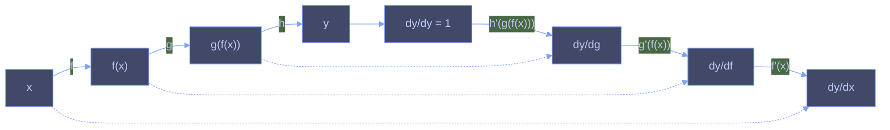

# 数値微分

コンピュータでは解析的に微分できないため，微小区間$h$の差異を用いて関数の変化量を求める．

$$
f'(x)=\lim_{h\to 0}\frac{f(x+h)-f(x)}{h}
$$

ただし，微小な差異を代入する場合，誤差は生れてしまう．誤差を減らす手法として**中心差分近似**がある．

$$
f'(x)=\lim_{h\to 0}\frac{f(x+h)-f(x-h)}{2h}
$$

<blockquote>
実際に前進差分近似よりも中心差分近似のほうが真の微分に近いことはテイラー展開によって証明可能
</blockquote>

しかし数値微分は計算コストが大きく，多変量解析にもなると計算は現実的でなくなる．そのために考案されたのが**バックプロパゲーション(誤差逆伝播法)**．

ただしバックプロパゲーションは複雑なアルゴリズムで容易にバグが現れてしまう．そこで実装の正しさを確認するために数値微分の結果を用いることがある(勾配確認)

# バックプロパゲーションの理論

合成関数の微分のこと．例えば$y=f(g(x))$の微分は

$$
\frac{dy}{dx}=f'(g(x))\cdot g'(x)=\frac{dy}{dg}\cdot\frac{dg}{dx}
$$

ここで3つの関数から成る合成関数を微分してみる

$$
y=h\circ g\circ f = h(g(f(x)))\quad\to\quad\frac{dy}{dx}=\frac{dy}{dy}\cdot\frac{dy}{dg}\cdot\frac{dg}{df}\cdot\frac{df}{dx}
$$

これを計算グラフで表現してみると

このような関係性になる
