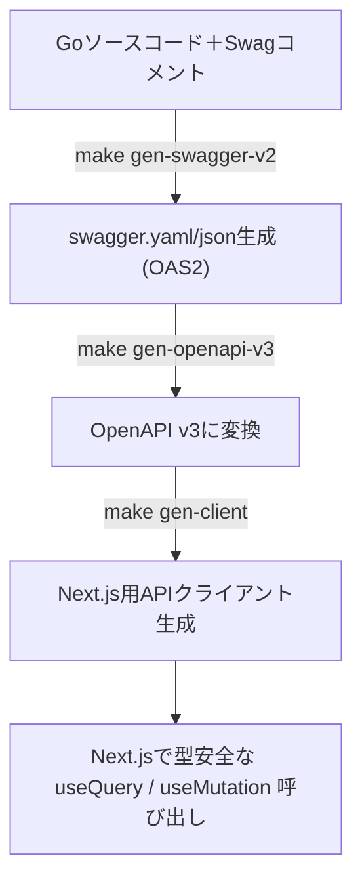
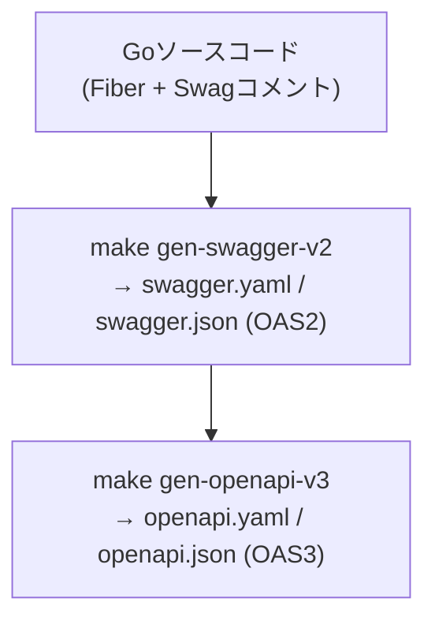
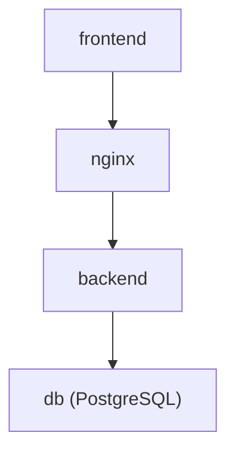
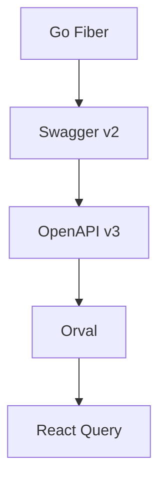

## はじめに

最近のWebアプリ開発では、**バックエンドとフロントエンドを分離した構成（SPA + API）**が一般的になっています。
特に **Go（Fiberなど）でREST APIを構築し、Next.jsでフロントエンドを実装する**ケースは多いでしょう。

しかし、この構成でよく直面するのが

> 「API仕様を変更したら、フロント側の型も全部直すのが面倒」
> 「エンドポイントの名前やレスポンス構造がずれてバグる」

といった、**API仕様のズレによる開発コスト**です。

---

### 本記事の目的

この記事では、Goで構築したAPIサーバーから **Swagger（OpenAPI）定義を自動生成し、Next.js側でその定義をもとに型付きAPIクライアントを自動生成する**仕組みを構築します。

これにより

- **バックエンドの更新に追従してフロントが自動で更新される**
- **通信層が完全に型安全になる**
- **APIクライアントの記述が不要になる（React Query対応）**

という、保守性と開発効率の高い開発環境を実現します。

---

### 使用する技術スタック

| レイヤー     | 技術                  | 役割                                    |
| ------------ | --------------------- | --------------------------------------- |
| **Backend**  | Go (Fiber)            | REST APIサーバー                        |
|              | swaggo/swag           | GoコードからSwagger(OpenAPI v2)生成     |
|              | openapi-generator-cli | Swagger v2 → OpenAPI v3 変換            |
| **Frontend** | Next.js (TypeScript)  | ReactベースのSPA                        |
|              | Orval                 | OpenAPI v3から型付きAPIクライアント生成 |
|              | Axios                 | API通信の実体クライアント               |
|              | React Query           | データフェッチ・キャッシュ管理          |
| **Infra**    | Docker / Makefile     | 環境構築・自動生成パイプライン          |

---

### 全体のフロー

本記事で実装する自動化パイプラインは以下のように動作します：



すべての生成処理は `Makefile` と `Docker` によって自動化されるため、
開発者は **コマンド一発でAPIとフロントエンドの同期を保てる**ようになります。

---

### 完成イメージ

最終的には、以下のような構成になります。

```tree
backend/
 ├─ cmd/server/main.go
 ├─ internal/
 ├─ docs/
 │   ├─ swagger.yaml
 │   ├─ swagger.json
 │   └─ v3/
 │        ├─ openapi.yaml
 │        └─ openapi.json
frontend/
 ├─ src/api/__generated__/      ← orvalが生成
 ├─ src/api/customAxios.ts
 ├─ src/api/orval.config.ts
 ├─ package.json
Makefile
```

この仕組みを整えておけば、**API設計の変更が即座にNext.js側へ反映される**ため、
APIとフロントの仕様不整合を根本的に防ぐことができます。

## 2. バックエンド（Go + Fiber）のSwagger生成

本章では、GoのAPIサーバーに対して **Swaggerドキュメントを自動生成する仕組み** を構築します。
Swagger（OpenAPI v2）はAPI仕様書のフォーマットであり、これを生成しておくことで後のクライアント自動生成に繋げられます。

---

### 2.1 Swaggoとは？

[Swaggo](https://github.com/swaggo/swag) は、Goのソースコードに埋め込まれたコメントから自動的にSwagger（OpenAPI v2）仕様を生成するツールです。
`swag init` コマンドを実行すると、指定したエントリーポイント（例：`cmd/server/main.go`）からコメントを解析し、`docs/` ディレクトリに `swagger.yaml` と `swagger.json` を出力します。

---

### 2.2 Swaggerコメントの書き方

Swaggoは**関数コメントの形式**を解析します。
以下は `handler/test_handler.go` に定義されたAPIの例です。

```go
// Create
//
// @Summary  Create a new test
// @Description Creates a test record and returns it
// @Tags   tests
// @Produce  json
// @Success  200 {object} TestResponse
// @Failure  500 {object} map[string]string
// @Router   /tests [post]
func (h *TestHandler) Create(c *fiber.Ctx) error {
 test, err := h.uc.CreateTest(c.Context())
 if err != nil {
  return c.Status(500).JSON(fiber.Map{"error": err.Error()})
 }
 return c.JSON(test)
}
```

- `@Summary` … 短い概要
- `@Description` … 詳細な説明
- `@Tags` … APIをグループ化するタグ名
- `@Produce` … レスポンス形式
- `@Success`, `@Failure` … ステータスコードとレスポンス型
- `@Router` … エンドポイントのパスとメソッド

Swaggoはこれらのコメントを読み取って、自動的にエンドポイントを定義してくれます。

---

### 2.3 API全体のメタ情報

Swaggerドキュメントのメタ情報（タイトル・バージョン・セキュリティなど）は、`main.go` に記述します。

```go
// @title      API
// @version     1.0
// @description    This is the API documentation for the application.
// @host      localhost
// @BasePath     /api
// @schemes     http
// @securityDefinitions.apikey ApiKeyAuth
// @in       header
// @name      Authorization
```

これにより、生成される `swagger.yaml` に以下のようなトップレベル情報が自動挿入されます。

```yaml
info:
  title: API
  version: "1.0"
  description: This is the API documentation for the application.
host: localhost
basePath: /api
schemes:
  - http
securityDefinitions:
  ApiKeyAuth:
    type: apiKey
    in: header
    name: Authorization
```

---

### 2.4 Swagコマンドの実行

通常であればローカルに `swag` をインストールして以下のように実行します：

```bash
go install github.com/swaggo/swag/cmd/swag@latest
swag init -g cmd/server/main.go --parseDependency
```

- `-g`：エントリーポイント（`main.go`）を指定
- `--parseDependency`：依存パッケージ（handlerなど）も含めて解析するオプション

これにより、`backend/docs` ディレクトリに以下のファイルが生成されます：

```tree
backend/docs/
 ├─ docs.go
 ├─ swagger.json
 └─ swagger.yaml
```

---

### 2.5 Docker + Makefileでの自動化

ローカル環境に `swag` を入れたくない場合は、Dockerでワンショット実行できます。
以下のMakefileタスクを使えば、どの環境でも同一コマンドで生成可能です。

```makefile
.PHONY: gen-swagger-v2
gen-swagger-v2:
 @echo "[OAS2] Generate swagger.yaml & swagger.json"
 docker run --rm -v $(PWD)/backend:/app -w /app golang:1.25-alpine \
   sh -c "go install github.com/swaggo/swag/cmd/swag@latest && \
   swag fmt && \
   swag init -g cmd/server/main.go --parseDependency"
```

実行コマンド：

```bash
make gen-swagger-v2
```

これにより、Dockerコンテナ内でSwaggoが実行され、`backend/docs` に `swagger.yaml` と `swagger.json` が生成されます。

---

### 2.6 生成結果の確認

生成後は、`backend/docs/swagger.yaml` を開くと、以下のようなAPI定義が自動で出力されているはずです：

```yaml
paths:
  /tests:
    get:
      tags:
        - tests
      summary: List all tests
      description: Returns all test records
      responses:
        "200":
          description: OK
          schema:
            type: array
            items:
              $ref: "#/definitions/TestResponse"
```

---

## 3. Swagger v2 → OpenAPI v3 への変換

Swaggoが生成する `swagger.yaml` / `swagger.json` は **OpenAPI v2（= Swagger 2.0）** 形式です。
しかし、後述する **Orval**（フロントエンド側のAPIクライアント自動生成ツール）は **OpenAPI v3** にのみ対応しています。

そのため本章では、**Swagger v2 → OpenAPI v3 の変換パイプライン**を構築します。

---

### 3.1 OpenAPI Generatorとは？

[OpenAPI Generator](https://openapi-generator.tech/) は、OpenAPI仕様書から多言語クライアント・サーバーコード・ドキュメントなどを自動生成するツールです。
実はこのツールには、**仕様変換（v2 → v3）**の機能も含まれています。

```bash
openapi-generator-cli generate \
  -i swagger.yaml \
  -g openapi-yaml \
  -o ./v3
```

- `-i`: 入力ファイル (`swagger.yaml`)
- `-g`: 出力形式（ここでは `openapi-yaml` または `openapi`）
- `-o`: 出力ディレクトリ
- `--minimal-update`: 既存ファイルがある場合に差分のみ更新する

このコマンドを実行すると、Swagger 2.0形式のYAMLを解析し、OpenAPI 3.0準拠の定義ファイルを生成してくれます。

---

### 3.2 Dockerで実行する理由

OpenAPI GeneratorはJavaベースのツールであり、ローカルで実行するにはJava環境が必要です。
しかし、開発チーム全員にJavaを入れるのは現実的ではありません。

そこで今回は、**公式Dockerイメージ `openapitools/openapi-generator-cli`** を使って変換を行います。
Dockerであればどの環境でも同一バージョンで再現でき、CI/CDにも組み込みやすくなります。

---

### 3.3 Makefileでの自動変換設定

以下の `gen-openapi-v3` タスクをMakefileに追加します。

```makefile
.PHONY: gen-openapi-v3
gen-openapi-v3:
 @echo "[OAS3] Convert swagger.yaml → openapi.yaml"
 docker run --rm -v $(PWD)/backend/docs:/work openapitools/openapi-generator-cli:latest-release \
   generate -i /work/swagger.yaml -o /work/v3 -g openapi-yaml --minimal-update

 @echo "[OAS3] Convert swagger.json → openapi.json"
 docker run --rm -v $(PWD)/backend/docs:/work openapitools/openapi-generator-cli:latest-release \
   generate -s -i /work/swagger.json -o /work/v3/openapi -g openapi --minimal-update

 @echo "[Cleanup]"
 docker run --rm -v $(PWD)/backend/docs/v3:/work golang:1.21-alpine \
   sh -c "mv /work/openapi/openapi.yaml /work && mv /work/openapi/openapi.json /work && rm -rf /work/openapi"
```

実行コマンド：

```bash
make gen-openapi-v3
```

実行結果：

```bash
[OAS3] Convert swagger.yaml → openapi.yaml
[OAS3] Convert swagger.json → openapi.json
[Cleanup]
```

生成後の構成は以下のようになります。

```tree
backend/docs/
 ├─ swagger.yaml         ← Swaggo生成 (v2)
 ├─ swagger.json         ← Swaggo生成 (v2)
 └─ v3/
     ├─ openapi.yaml     ← OpenAPI Generatorで変換 (v3)
     └─ openapi.json     ← OpenAPI Generatorで変換 (v3)
```

---

### 3.4 実際に変換された差分例

変換後のYAMLを開くと、`swagger: "2.0"` が `openapi: 3.0.1` に変わり、定義スキーマの構造も新形式に置き換わります。

#### 変換前（Swagger 2.0）

```yaml
swagger: "2.0"
info:
  title: API
paths:
  /tests:
    get:
      produces:
        - application/json
      responses:
        200:
          schema:
            type: array
            items:
              $ref: "#/definitions/TestResponse"
```

#### 変換後（OpenAPI 3.0）

```yaml
openapi: 3.0.1
info:
  title: API
paths:
  /tests:
    get:
      responses:
        200:
          description: OK
          content:
            application/json:
              schema:
                type: array
                items:
                  $ref: "#/components/schemas/TestResponse"
components:
  schemas:
    TestResponse:
      type: object
      properties:
        id:
          type: integer
```

OpenAPI 3.0では `produces` / `consumes` の代わりに `content` フィールドが導入され、
スキーマ定義も `definitions` → `components.schemas` に整理されているのが分かります。

---

### 3.5 OAS3変換のメリット

OpenAPI v3へ変換することで、以下の利点が得られます。

| 項目                           | 説明                                                  |
| ------------------------------ | ----------------------------------------------------- |
| **最新仕様への対応**           | OpenAPI v3はJSON Schema互換で、より厳密な型定義が可能 |
| **ツールエコシステムの拡張性** | Orval・Stoplightなど最新ツール群がv3に準拠            |
| **型生成の精度向上**           | NullableやOneOfなど複雑なスキーマを正確に表現できる   |
| **将来的な拡張性**             | gRPC GatewayやGraphQLとの連携にも発展可能             |

---

### 3.6 一連の流れをおさらい

ここまでで、Goのソースコードから次のような流れが完成しました：



このOpenAPI v3定義を使えば、次章で **Next.js側のAPIクライアントを自動生成** できます。

---

## 4. フロントエンド（Next.js）側のクライアント生成

前章までで、バックエンドから **OpenAPI v3形式** の仕様書が自動生成できるようになりました。
ここからは、その仕様をもとに **Next.js（TypeScript）側で型安全なAPIクライアントを自動生成** していきます。

使用するのは、OpenAPIクライアント生成ツール **Orval** です。

---

### 4.1 Orvalとは？

[Orval](https://orval.dev/) は、OpenAPI仕様から**型付きのフロントエンドAPIクライアントを自動生成**するツールです。
生成されるコードはTypeScriptで、AxiosやReact Queryといった主要ライブラリと統合できます。

#### Orvalを使うメリット

| 項目                | 内容                                                            |
| ------------------- | --------------------------------------------------------------- |
| **型安全なAPI通信** | OpenAPIのスキーマに基づいてリクエスト・レスポンスを完全に型付け |
| **React Query連携** | `useGetUsersQuery()` など、即使えるカスタムフックを自動生成     |
| **自動更新**        | OpenAPI仕様が変わるたびに再生成するだけで常に最新化             |
| **開発効率**        | フロント側でAPIロジックを書く必要がなくなる                     |

---

### 4.2 必要ライブラリの導入

まず、フロントエンドプロジェクトに以下をインストールします。

```bash
pnpm add orval -D
pnpm add axios
pnpm add @tanstack/react-query@4
```

- `orval`：APIクライアント自動生成ツール
- `axios`：HTTPクライアント（Orvalが内部で利用）
- `@tanstack/react-query`：データフェッチ管理ライブラリ（v4を指定）

---

### 4.3 orval.config.ts の設定

Orvalの設定ファイルを `frontend/orval.config.ts` に作成します。
このファイルで、入力するOpenAPI定義と出力先の構造を定義します。

```ts
import { defineConfig } from "orval";

export default defineConfig({
  stepOfficialWebsite: {
    input: "../backend/docs/v3/openapi.yaml",
    output: {
      target: "./src/api/__generated__/",
      schemas: "./src/api/__generated__/schemas",
      client: "react-query",
      mode: "tags-split",
      override: {
        mutator: {
          path: "./src/api/customAxios.ts",
          name: "customAxios",
          default: true,
        },
        query: {
          useQuery: true,
          usePrefetch: true,
        },
      },
    },
  },
});
```

#### 各設定の解説

| フィールド         | 意味                                                   |
| ------------------ | ------------------------------------------------------ |
| `input`            | 変換元のOpenAPIファイル（相対パスで指定）              |
| `target`           | 自動生成コードの出力先ディレクトリ                     |
| `schemas`          | スキーマ型定義の出力先                                 |
| `client`           | 使用するHTTPクライアント（`react-query`を指定）        |
| `mode`             | 出力分割モード（`tags-split`はタグ単位でファイル分割） |
| `override.mutator` | Axios設定をカスタマイズするファイルを指定              |
| `override.query`   | React Query用のオプションを指定                        |

---

### 4.4 カスタムAxiosクライアントの実装

API呼び出し時の `baseURL` やログ処理を統一するために、`customAxios.ts` を定義します。
Orvalは `mutator` 経由でこのAxiosインスタンスを利用します。

```ts
import axios, { AxiosRequestConfig, AxiosError } from "axios";

const isServer = typeof window === "undefined";

const customAxios = async <T = unknown>(
  config: AxiosRequestConfig,
  options?: AxiosRequestConfig,
): Promise<T> => {
  const instance = axios.create({
    baseURL: isServer ? "http://backend:8080" : "/api",
  });

  try {
    const res = await instance.request({
      ...config,
      ...options,
      headers: {
        ...config.headers,
        ...options?.headers,
      },
    });

    return res.data;
  } catch (err) {
    const error = err as AxiosError;

    if (isServer) {
      console.error("Failed to request:", {
        url: config.url,
        method: config.method,
        status: error.response?.status,
        data: error.response?.data,
      });
    }

    throw error;
  }
};

export default customAxios;
```

#### 💡ポイント

- SSR環境（Next.jsのサーバー側）では `http://backend:8080` を使用
- CSR環境（ブラウザ）では `/api` にプロキシ
- 例外発生時にはレスポンスをログ出力

---

### 4.5 package.json にスクリプト追加

Orvalをnpmスクリプトから呼び出せるように設定します。

```json
{
  "scripts": {
    "dev": "next dev --turbopack",
    "build": "next build --turbopack",
    "start": "next start",
    "lint": "eslint",
    "gen:client": "orval --config orval.config.ts"
  }
}
```

これで、次のコマンドを実行すればクライアントを自動生成できます。

```bash
pnpm run gen:client
```

---

### 4.6 Makefileによる自動化

さらに、バックエンドと同様にMakefileで統合タスクを用意します。

```makefile
.PHONY: gen-client
gen-client:
 @echo "[Clean] Remove old generated client"
 rm -rf frontend/src/api/__generated__
 @echo "[Generate] Running npm run gen:client"
 cd frontend && npm run gen:client
```

コマンド一発で古いクライアントを削除 → 再生成まで実行可能です。

```bash
make gen-client
```

---

### 4.7 生成結果の確認

コマンド実行後、以下のような構成が生成されます。

```tree
frontend/
 ├─ src/api/
 │   ├─ __generated__/        ← 自動生成コード
 │   │   ├─ schemas/
 │   │   │   └─ TestResponse.ts
 │   │   ├─ tests/
 │   │   │   ├─ useGetTestsQuery.ts
 │   │   │   └─ useCreateTestMutation.ts
 │   │   └─ index.ts
 │   ├─ customAxios.ts
 │   └─ orval.config.ts
```

生成された関数・フック例：

```ts
import {
  useGetTestsQuery,
  useCreateTestMutation,
} from "@/api/__generated__/tests";

// 一覧取得
const { data } = useGetTestsQuery();

// 新規作成
const { mutate } = useCreateTestMutation();
mutate({ ...payload });
```

これで、フロントエンドは**完全型安全かつ自動同期されたAPI呼び出し環境**を得られます。

---

### 4.8 開発フロー全体の統合

ここまでの工程をMakefileにまとめると、以下のような一連の自動化パイプラインが完成します：

```bash
make gen-swagger-v2   # GoからSwagger (v2) 生成
make gen-openapi-v3   # OpenAPI v3に変換
make gen-client       # Next.js側クライアント自動生成
```

これらを順に実行することで、**バックエンドの変更がフロントエンドまで自動で反映される**ようになります。

---

### ✅ まとめ

| ステップ         | ツール            | 出力                        |
| ---------------- | ----------------- | --------------------------- |
| Goコメント解析   | Swaggo            | swagger.yaml / swagger.json |
| 仕様変換         | OpenAPI Generator | openapi.yaml / openapi.json |
| クライアント生成 | Orval             | TypeScript APIクライアント  |

これにより、「API仕様を直したらフロントが壊れる」というよくある問題を根本的に防ぎつつ、**開発速度と品質を両立**できます。

## 5. React Queryとの統合

Orvalは、OpenAPI仕様から**Axios + React QueryベースのAPIクライアント**を自動生成します。
この仕組みを活かすことで、Next.jsのフロントエンドは「手書きのAPI呼び出し」から解放され、**完全に型安全なデータフェッチ層**を実現できます。

---

### 5.1 React Queryとは？

[React Query（@tanstack/react-query）](https://tanstack.com/query/v4/docs/framework/react/overview) は、
データフェッチ・キャッシュ・エラーハンドリング・再取得などを自動で管理してくれるライブラリです。

#### 💡 これまでの問題点

従来の`useEffect`＋`axios`構成では：

- ローディング状態やエラー処理を毎回書く必要がある
- データキャッシュが効かないため無駄な再フェッチが発生
- 並列リクエストや再取得の制御が煩雑

#### ✅ React Queryを使うと

- `useQuery` / `useMutation` だけでデータ取得・更新が完結
- キャッシュ・リトライ・再フェッチなどを自動管理
- フロント側の「状態管理」を大幅に削減できる

---

### 5.2 OrvalによるReact Queryフック生成

`orval.config.ts` で `client: "react-query"` を指定しているため、
`pnpm run gen:client` を実行すると自動的にReact Query対応のフックが生成されます。

#### 生成例

```tree
frontend/src/api/__generated__/tests/
 ├─ useGetTestsQuery.ts
 ├─ useCreateTestMutation.ts
 └─ index.ts
```

これらのフックをそのままReactコンポーネントで呼び出せます。

---

### 5.3 QueryClientのセットアップ

まず、アプリ全体でReact Queryを有効にするため、
Next.jsの`_app.tsx`（または`layout.tsx`）で`QueryClientProvider`を設定します。

```tsx
// src/pages/_app.tsx
import { QueryClient, QueryClientProvider } from "@tanstack/react-query";
import { ReactQueryDevtools } from "@tanstack/react-query-devtools";
import type { AppProps } from "next/app";

const queryClient = new QueryClient();

export default function App({ Component, pageProps }: AppProps) {
  return (
    <QueryClientProvider client={queryClient}>
      <Component {...pageProps} />
      <ReactQueryDevtools initialIsOpen={false} />
    </QueryClientProvider>
  );
}
```

これで全ページから自動生成フックが使えるようになります。

---

### 5.4 取得処理の例：`useGetTestsQuery`

Orvalが自動生成する `useGetTestsQuery` は、
`GET /tests` エンドポイントに対応した型安全なフェッチ関数です。

```tsx
// src/pages/tests.tsx
import { useGetTestsQuery } from "@/api/__generated__/tests";

export default function TestsPage() {
  const { data, isLoading, isError } = useGetTestsQuery();

  if (isLoading) return <p>Loading...</p>;
  if (isError) return <p>Failed to load data.</p>;

  return (
    <div>
      <h1>Tests</h1>
      <ul>{data?.map((item) => <li key={item.id}>ID: {item.id}</li>)}</ul>
    </div>
  );
}
```

#### Docker構成の特徴

- `data` の型は自動的に `TestResponse[]` と推論される
- `isLoading`, `isError` などの状態も標準提供
- バックエンドの変更に追従して型が即座に更新

---

### 5.5 登録処理の例：`useCreateTestMutation`

POSTエンドポイント（`/tests [post]`）に対応するのが `useCreateTestMutation`。
ミューテーション（更新系処理）はReact Queryの`mutate`を使って実行します。

```tsx
// src/pages/create-test.tsx
import { useState } from "react";
import { useCreateTestMutation } from "@/api/__generated__/tests";

export default function CreateTestPage() {
  const [text, setText] = useState("");
  const mutation = useCreateTestMutation();

  const handleSubmit = () => {
    mutation.mutate(
      { name: text }, // 入力データ
      {
        onSuccess: (data) => alert(`Created! ID: ${data.id}`),
        onError: (err) => alert("Failed: " + err),
      },
    );
  };

  return (
    <div>
      <h1>Create Test</h1>
      <input value={text} onChange={(e) => setText(e.target.value)} />
      <button onClick={handleSubmit} disabled={mutation.isLoading}>
        {mutation.isLoading ? "Submitting..." : "Submit"}
      </button>
    </div>
  );
}
```

#### ポイント

- `mutate` はPromiseではなくコールバックベースで扱う
- 状態変化（`isLoading`, `isSuccess`, `isError`）を自動管理
- 成功時にキャッシュを自動で更新する設定も可能

---

### 5.6 データキャッシュと再フェッチ

React Queryの最大の強みは、**自動キャッシュと再フェッチ制御**です。
Orval生成フックも内部的に `useQuery` を利用しているため、キャッシュが自動で効きます。

```tsx
const { data } = useGetTestsQuery(undefined, {
  staleTime: 1000 * 60 * 5, // 5分間キャッシュ有効
});
```

- `staleTime`：データを再取得せずキャッシュを使う期間
- `refetchOnWindowFocus`：フォーカス時に再フェッチするか（デフォルトtrue）
- `enabled`：条件付きフェッチを制御

これらのオプションはOrval経由でもそのまま利用可能です。

---

### 5.7 Orvalのプリフェッチ機能

`orval.config.ts` の `usePrefetch: true` により、
`usePrefetchGetTestsQuery()` のような**事前取得用関数**も自動生成されます。

```tsx
const prefetch = usePrefetchGetTestsQuery();

useEffect(() => {
  prefetch(); // ページ遷移前にデータをキャッシュ
}, []);
```

これにより、ページ遷移時にすでにデータがキャッシュされており、**瞬時に表示**できるようになります。

---

### 5.8 React Query Devtools でのデバッグ

開発中は [React Query Devtools](https://tanstack.com/query/v4/docs/devtools) を有効にすると便利です。
キャッシュの状態やフェッチ履歴を可視化できます。

```tsx
import { ReactQueryDevtools } from "@tanstack/react-query-devtools";

// _app.tsx 内に追加済み
<ReactQueryDevtools initialIsOpen={false} />;
```

ブラウザ右下に Devtools が表示され、APIキャッシュの挙動をリアルタイムで確認可能です。

---

### まとめ：トラブルシューティングガイド

| 要素                      | 内容                                            |
| ------------------------- | ----------------------------------------------- |
| **クエリ系API**           | `useGetXxxQuery()` で自動キャッシュ付きフェッチ |
| **ミューテーション系API** | `useCreateXxxMutation()` でPOST/PUT/DELETE操作  |
| **型定義**                | OpenAPIスキーマから自動生成（変更にも即追従）   |
| **React Query統合**       | キャッシュ・リトライ・状態管理が自動化          |

これで、**バックエンド → OpenAPI → Orval → React Query → UI**
という、理想的なフル自動型安全データフローが完成しました。

---

## 6. Docker Composeでの連携実行

ここまでで、

- Go（Fiber）でAPIサーバーを構築し
- Swagger → OpenAPI → Orval で自動クライアントを生成し
- Next.js でReact Queryを使ってデータを扱う
  という仕組みを完成させました。

この章では、**Docker Composeで「開発環境」と「本番環境」を明確に分離しつつ連携動作させる構成**を紹介します。

---

### 6.1 全体構成図

アプリは以下の4サービスで構成されています。



- **frontend**：Next.js（TypeScript）
- **backend**：Go（Fiber）
- **db**：PostgreSQL
- **nginx**：リバースプロキシ（フロント・バックの統合）

---

### 6.2 開発環境（docker-compose.dev.yml）

開発環境では、**ホットリロード・同期マウント・軽量再ビルド**を重視した構成です。

```yaml
version: "3.9"

x-common: &common
  restart: unless-stopped
  networks:
    - app-network

services:
  backend:
    <<: *common
    build:
      context: ..
      dockerfile: deploy/docker/backend/Dockerfile.dev
    volumes:
      - ../backend:/app
      - go_mod_cache:/go/pkg/mod
    ports:
      - "8080:8080"
    env_file:
      - .env.dev
    develop:
      watch:
        - action: sync
          path: ../backend
          target: /app
        - action: rebuild
          path: ../backend/go.mod

  frontend:
    <<: *common
    build:
      context: ..
      dockerfile: deploy/docker/frontend/Dockerfile.dev
    volumes:
      - ../frontend:/app
      - /app/node_modules
      - /app/.next
    ports:
      - "3000:3000"
    env_file:
      - .env.dev
    develop:
      watch:
        - action: sync
          path: ../frontend
          target: /app
          ignore:
            - node_modules/
            - .next/
        - action: rebuild
          path: ../frontend/package.json

  db:
    <<: *common
    build:
      context: ..
      dockerfile: deploy/docker/db/Dockerfile
    ports:
      - "5432:5432"
    volumes:
      - db_data:/var/lib/postgresql/data
    env_file:
      - .env.dev
    command:
      [
        "postgres",
        "-c",
        "log_statement=all",
        "-c",
        "log_destination=stderr",
        "-c",
        "shared_preload_libraries=pg_stat_statements",
      ]

  nginx:
    <<: *common
    build:
      context: ..
      dockerfile: deploy/docker/nginx/Dockerfile
    ports:
      - "80:80"
    depends_on:
      - frontend
      - backend

volumes:
  db_data:
    driver: local
  go_mod_cache:
    driver: local
  pnpm_cache:
    driver: local

networks:
  app-network:
    driver: bridge
```

#### ✅ 特徴

- `develop.watch` によりコード変更をリアルタイム反映
- `backend` は Air によるホットリロード対応
- `frontend` は Turbopack の dev モードで起動
- Nginx 経由で `http://localhost` から全体をアクセス可能

---

### 6.3 本番環境（docker-compose.prod.yml）

本番環境では、**最適化ビルド済みコンテナ**を使用し、
すべてのアプリケーションを軽量・堅牢に実行します。

```yaml
version: "3.9"

x-common: &common
  restart: unless-stopped
  networks:
    - app-network

services:
  backend:
    <<: *common
    build:
      context: ..
      dockerfile: deploy/docker/backend/Dockerfile.prod
    ports:
      - "8080:8080"
    env_file:
      - .env.prod
    healthcheck:
      test: ["CMD", "curl", "-f", "http://localhost:8080"]
      interval: 30s
      timeout: 10s
      retries: 3
    depends_on:
      db:
        condition: service_healthy

  frontend:
    <<: *common
    build:
      context: ..
      dockerfile: deploy/docker/frontend/Dockerfile.prod
    ports:
      - "3000:3000"
    env_file:
      - .env.prod
    depends_on:
      backend:
        condition: service_healthy

  db:
    <<: *common
    build:
      context: ..
      dockerfile: deploy/docker/db/Dockerfile
    ports:
      - "5432:5432"
    volumes:
      - db_data:/var/lib/postgresql/data
    env_file:
      - .env.prod
    healthcheck:
      test: ["CMD-SHELL", "pg_isready -U postgres"]
      interval: 10s
      timeout: 5s
      retries: 5
    command:
      [
        "postgres",
        "-c",
        "shared_preload_libraries=pg_stat_statements",
        "-c",
        "max_connections=200",
        "-c",
        "shared_buffers=256MB",
        "-c",
        "effective_cache_size=1GB",
        "-c",
        "work_mem=4MB",
        "-c",
        "maintenance_work_mem=64MB",
        "-c",
        "checkpoint_completion_target=0.7",
        "-c",
        "wal_buffers=16MB",
        "-c",
        "default_statistics_target=100",
      ]

  nginx:
    <<: *common
    build:
      context: ..
      dockerfile: deploy/docker/nginx/Dockerfile
    ports:
      - "80:80"
    depends_on:
      frontend:
        condition: service_started
      backend:
        condition: service_healthy

volumes:
  db_data:
    driver: local

networks:
  app-network:
    driver: bridge
```

#### 特徴

- `builder` → `runner` のマルチステージで極限まで軽量化
- `healthcheck` により自動依存解決（DB→API→Front）
- Nginx がフロントエンドとAPIのリバースプロキシを統一管理

---

### 6.4 Nginxの設定

`deploy/docker/nginx/default.conf` では、
フロントエンドとバックエンドを1つのドメインで扱うようルーティングしています。

```nginx
server {
    listen 80;

    # Frontend requests
    location / {
        proxy_pass http://frontend:3000;
        proxy_set_header Host $host;
        proxy_set_header X-Real-IP $remote_addr;
    }

    # Backend API requests
    location /api/ {
        proxy_pass http://backend:8080/;
        proxy_set_header Host $host;
        proxy_set_header X-Real-IP $remote_addr;
    }
}
```

これにより、ブラウザからは `/api/...` と叩くだけで内部的に `backend:8080` に転送されます。

---

### 6.5 Makefileによる起動コマンド

開発と本番を簡単に切り替えられるよう、Makefileで統一コマンドを提供します。

```makefile
# ==========================
# Development
# ==========================
.PHONY: dev-up dev-down
dev-up:
 @echo "[Start] Development Environment"
 docker compose -f deploy/docker-compose.dev.yml --env-file deploy/.env.dev up --build

dev-down:
 @echo "[Stop] Development Environment"
 docker compose -f deploy/docker-compose.dev.yml down -v

# ==========================
# Production
# ==========================
.PHONY: prod-up prod-down
prod-up:
 @echo "[Start] Production Environment"
 docker compose -f deploy/docker-compose.prod.yml --env-file deploy/.env.prod up --build -d

prod-down:
 @echo "[Stop] Production Environment"
 docker compose -f deploy/docker-compose.prod.yml down -v
```

これで以下のように使えます：

```bash
make dev-up     # 開発環境起動
make dev-down   # 開発環境停止
make prod-up    # 本番起動（デタッチモード）
make prod-down  # 本番停止
```

---

### 6.6 APIクライアント生成も含めた統合ワークフロー

Makefileを拡張し、Swagger・OpenAPI・Orvalの生成も一気に実行できます。

```makefile
.PHONY: gen-all
gen-all:
 @echo "[Pipeline] Generating Swagger, OpenAPI v3, and API client"
 make gen-swagger-v2
 make gen-openapi-v3
 make gen-client
```

これにより、**バックエンドの変更 → OpenAPI更新 → フロント同期** まで
すべてワンコマンドで完了します。

---

### 6.7 起動確認

| URL                                                                                  | 内容                                  |
| ------------------------------------------------------------------------------------ | ------------------------------------- |
| [http://localhost](http://localhost)                                                 | フロントエンド（Next.js + Nginx）     |
| [http://localhost/api/tests](http://localhost/api/tests)                             | Go API (Fiber) の確認用エンドポイント |
| [http://localhost:8080/swagger/index.html](http://localhost:8080/swagger/index.html) | Swagger UI                            |
| [http://localhost:3000](http://localhost:3000)                                       | Next.jsの直接アクセス                 |

開発中は `http://localhost` だけで両方にアクセスでき、本番でもNginxが同様に統合します。

---

### まとめ

| 項目             | 内容                                        |
| ---------------- | ------------------------------------------- |
| **開発環境**     | ソースコード同期・ホットリロード付き構成    |
| **本番環境**     | 軽量ビルド済みマルチステージ構成            |
| **通信統合**     | Nginxによる `/api` リバースプロキシ         |
| **Makefile操作** | `make dev-up` / `make prod-up` で統一       |
| **自動生成統合** | `make gen-all` でSwagger→OpenAPI→Client一括 |

---

## 7. トラブルシューティング

ここまで構築した自動生成パイプラインは強力ですが、
実際に運用していると以下のような問題に遭遇することがあります。

- SwaggerやOpenAPIの生成がうまくいかない
- Orvalの型生成でエラーが出る
- Docker間の通信ができない
- 本番ビルドでAPIが404になる

この章では、それぞれの原因と解決策をまとめます。

---

### 7.1 Swaggo（Swagger生成）でのトラブル

#### ❌ エラー例（Swagger生成）

```bash
Error: failed to parse packages analyzing cmd/server/main.go: cannot find module for path ...
```

#### 💡 原因（7.1.1）

`swag init` 実行時にモジュールの依存関係を解決できていないか、`go.mod` が正しいディレクトリ構造にない。

#### ✅ 対処法

1. backendディレクトリ内で依存を再取得

   ```bash
   cd backend
   go mod tidy
   ```

2. `main.go` の `@Router` / `@Summary` などのコメントに誤字がないか確認
3. Docker経由で動かす場合、Makefileの `-w /app` が正しいか確認

   ```makefile
   docker run --rm -v $(PWD)/backend:/app -w /app golang:1.25-alpine ...
   ```

#### 🛡 再発防止策

- `backend` 以下のみにGoコードを配置する
- `swag init -g cmd/server/main.go --parseDependency` を必ず指定する

---

### 7.2 OpenAPI Generatorでの変換失敗

#### ❌ エラー例（OpenAPI変換）

```bash
Error: Could not resolve reference: '#/definitions/TestResponse'
```

#### 💡 原因

Swagger v2 の `definitions` が正しく生成されていないか、コメントで型を正しく指定していない。

#### ✅ 対処法

1. `@Success 200 {object} TestResponse` のように構造体名を明示的に指定
2. Swaggerファイルを手動で開き、`definitions:` ブロックに `TestResponse` が含まれているか確認
3. 不要なファイルを削除して再生成

   ```bash
   rm -rf backend/docs
   make gen-swagger-v2
   make gen-openapi-v3
   ```

#### 🛡 再発防止策

- `swag fmt` をMakefileで常に実行してコメント整形
- `@Param`, `@Success`, `@Failure` は正確に書く

---

### 7.3 Orvalでの型生成エラー

#### ❌ エラー例（Orval）

```bash
Error: Cannot find module '../backend/docs/v3/openapi.yaml'
```

#### 💡 原因

`openapi.yaml` の出力パスが異なるか、`frontend/orval.config.ts` の `input` が相対パスでずれている。

#### ✅ 対処法

1. Orval設定で正しい相対パスを指定

   ```ts
   input: "../backend/docs/v3/openapi.yaml",
   ```

2. 一度生成物を削除して再実行

   ```bash
   make gen-client
   ```

#### 🛡 再発防止策

- `backend/docs/v3` を `.gitignore` から除外し、他の開発者と共有
- OpenAPI出力先は固定ディレクトリに統一

---

### 7.4 Dockerコンテナ間で通信できない

#### ❌ 症状

- `axios` が `ECONNREFUSED` を返す
- `GET /api/tests` がタイムアウトする

#### 💡 原因

- `baseURL` がホスト向け (`localhost`) になっている
- コンテナ名で通信していない

#### ✅ 対処法

`frontend/src/api/customAxios.ts` の設定を確認：

```ts
const instance = axios.create({
  baseURL: typeof window === "undefined" ? "http://backend:8080" : "/api",
});
```

Docker Composeでは、`backend` がネットワーク名なので `backend:8080` にする必要があります。

#### 🛡 再発防止策

- `localhost` ではなくサービス名でアクセス
- `nginx` 経由に統一（`/api/` → `backend:8080/`）

---

### 7.5 Next.jsのビルド失敗（pnpm関連）

#### ❌ エラー例（Next.js）

```bash
Error: Cannot find module 'next'
```

#### 💡 原因

`node_modules` がDockerコンテナ内にのみ存在し、ホスト側のVSCode補完が効いていない。

#### ✅ 対処法

1. ホストにも依存を入れる

   ```bash
   cd frontend
   pnpm install
   ```

2. `.vscode/settings.json` にTypeScript SDKを明示指定

   ```json
   {
     "typescript.tsdk": "frontend/node_modules/typescript/lib"
   }
   ```

#### 🛡 再発防止策

- `node_modules` はホストに保持 or VSCode設定で補完を有効化
- Composeのvolumeマウントで `- /app/node_modules` を適切に扱う

---

### 7.6 Nginx経由の404エラー

#### ❌ 症状

ブラウザで `http://localhost/api/tests` にアクセスすると
「404 Not Found」が返る。

#### 💡 原因

- `default.conf` の `location /api/` に末尾スラッシュ (`/`) がない
- プロキシパスが `http://backend:8080` で終わっていない

#### ✅ 修正例

```nginx
location /api/ {
    proxy_pass http://backend:8080/;  # ← スラッシュ必須
}
```

#### 🛡 再発防止策

- `proxy_pass` の末尾スラッシュは常に確認
- `nginx -t` で構文チェックしてから再起動

---

### 7.7 本番ビルド後に `server.js` が見つからない

#### ❌ エラー例（server.js）

```bash
Error: Cannot find module '/app/server.js'
```

#### 💡 原因

Next.js 13以降で `output: "standalone"` 設定がされていないか、
`builder` ステージで `server.js` が生成されていない。

#### ✅ 対処法

1. `next.config.js` に以下を追加：

   ```js
   module.exports = {
     output: "standalone",
   };
   ```

2. 再ビルド：

   ```bash
   docker compose -f deploy/docker-compose.prod.yml build frontend
   ```

#### 🛡 再発防止策

- `pnpm build` のログで `server.js` が生成されているか確認
- 本番Dockerfileで `.next/standalone` を必ずコピー

---

### 7.8 DBコンテナが起動しない

#### ❌ エラー例（DB起動）

```bash
database system is starting up
pg_isready: server not accepting connections
```

#### 💡 原因

`POSTGRES_USER` / `POSTGRES_PASSWORD` / `POSTGRES_DB` が不整合
またはVolumeに古いデータが残っている。

#### ✅ 対処法

```bash
docker compose down -v
make dev-up
```

#### 🛡 再発防止策

- `.env.dev` / `.env.prod` のDB設定を明示的に管理
- Volumeを共有せず、環境ごとに分離する

---

### 7.9 キャッシュが古くて変更が反映されない

#### ❌ 症状

Dockerビルド後も古いコードが反映されない。

#### ✅ 対処法

```bash
docker compose build --no-cache
```

#### 🛡 再発防止策

- 開発中は `:latest` タグやキャッシュ共有を避ける
- `develop.watch` を利用してリアルタイム反映

---

### まとめ：チェックリスト

| 項目        | よくある問題     | 解決策                                     |
| ----------- | ---------------- | ------------------------------------------ |
| Swagger生成 | コメント構文ミス | `swag fmt` + `--parseDependency`           |
| OpenAPI変換 | 型参照エラー     | `@Success {object} TypeName`               |
| Orval生成   | パスずれ         | `input: "../backend/docs/v3/openapi.yaml"` |
| Docker通信  | ECONNREFUSED     | `baseURL = backend:8080`                   |
| Nginx設定   | 404エラー        | `proxy_pass` の末尾スラッシュ              |
| Next.js本番 | `server.js` 不在 | `output: "standalone"`                     |
| DB起動      | 古いVolume       | `docker compose down -v`                   |

---

## 8. まとめと今後の発展

ここまでで、**Go（Fiber）× Next.js × OpenAPI** を軸にした
完全な自動APIクライアント生成パイプラインを構築しました。

---

### 8.1 今回構築した仕組みの全体像



これを1本のパイプラインとしてつなぎ、
**「バックエンドの更新が即フロントに反映される」**仕組みを実現しました。

| ステップ           | 内容                                   | コマンド              |
| ------------------ | -------------------------------------- | --------------------- |
| ① Swagger生成      | GoのコメントからAPI仕様生成            | `make gen-swagger-v2` |
| ② OpenAPI変換      | Swagger → OpenAPI 3.0形式に変換        | `make gen-openapi-v3` |
| ③ クライアント生成 | Orval + React Queryで型安全なHooks生成 | `make gen-client`     |
| ④ 開発実行         | Docker Composeで全サービス起動         | `make dev-up`         |

すべてを自動化することで、
仕様・実装・ドキュメント・通信層を**完全同期**させることができます。

---

### 8.2 この構成のメリット

#### **① 型安全な通信層**

バックエンド変更時に自動で型が更新されるため、
フロントエンド側でAPIミスマッチを防止できます。

#### **② 即時反映・ホットリロード**

Dockerの `develop.watch` + `air` + `Turbopack` により、
両側の変更をほぼリアルタイムで反映。

#### **③ 開発環境と本番環境の完全分離**

`.env.dev` / `.env.prod` による設定分離と
マルチステージDockerfileによって、
**開発の柔軟性**と**本番の軽量性**を両立。

#### **④ CI/CDにも組み込みやすい構成**

Makefileを使った統一的コマンド群により、
GitHub ActionsなどのCI/CDにも簡単に組み込めます。

---

### 8.3 今後の発展ポイント

今回の構成は基礎として非常に強力ですが、
より実践的に拡張する余地も多くあります。

#### **① CI/CDとの統合**

GitHub Actionsで `make gen-all` → `make prod-up` の自動化を行えば、
API仕様変更がpushされたタイミングで
**自動的にOpenAPI更新 → クライアント再生成 → デプロイ**まで実行できます。

#### **② 認証・認可の追加**

Swaggerコメントに以下のような定義を追加すれば、
JWTやOAuth2のスキーマもOpenAPI経由で自動生成可能です。

```go
// @securityDefinitions.apikey ApiKeyAuth
// @in header
// @name Authorization
```

→ フロントではOrval生成クライアントにInterceptorを追加して
トークンを自動付与できるようになります。

#### **③ OpenAPIから型生成の高度化**

Orvalの `transformer` オプションを活用することで、
レスポンスを自動整形・キャッシュ更新・エラーハンドリングも共通化可能です。

#### **④ モノレポ構成への拡張**

プロジェクトをMonorepo（例: `backend/`, `frontend/`, `shared/`）化し、
`shared/types` に共通定義を配置すると、
バックエンドとフロントで型を共有できます。

#### **⑤ gRPC / GraphQL への発展**

REST APIをOpenAPIで運用する基盤が整ったら、
将来的には gRPC や GraphQL へ移行する際にも
この構成をベースにスムーズに拡張できます。

---

### 8.4 最後に

この一連の仕組みは、
**「仕様変更に強い開発体験」**を実現するための重要な基盤です。

- Goのコメント → 自動ドキュメント化
- OpenAPIによる仕様の標準化
- Orval + React Queryによる型安全通信
- Docker Composeでの環境再現性
- Makefileによる開発プロセスの自動化

これらを組み合わせることで、
**バックエンドとフロントエンドの乖離を最小化し、チーム全体の速度と品質を最大化**できます。

---

### 今後やるべき一歩

| フェーズ | 内容                                       |
| -------- | ------------------------------------------ |
| ✅ 現在  | Swagger → OpenAPI → Orval 自動連携構築     |
| 🚀 次    | CI/CD自動化・JWT認証連携                   |
| 🌐 将来  | Monorepo化・gRPCやGraphQL対応・RAG連携など |

---

> 🏁 **この構成は“現代的なフルスタック自動化”のベースライン。**
> 一度整えば、API開発・型生成・デプロイ・モニタリングまでを
> 一貫してスケーラブルに運用できるようになります。
