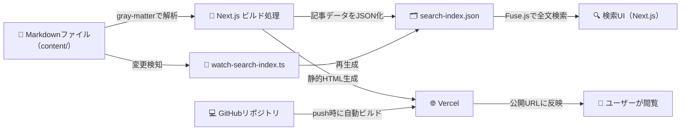
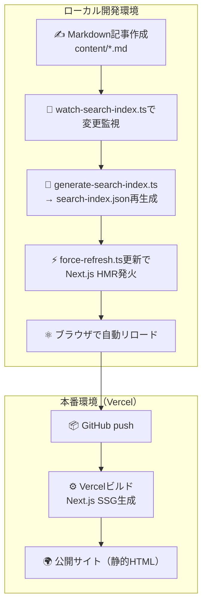
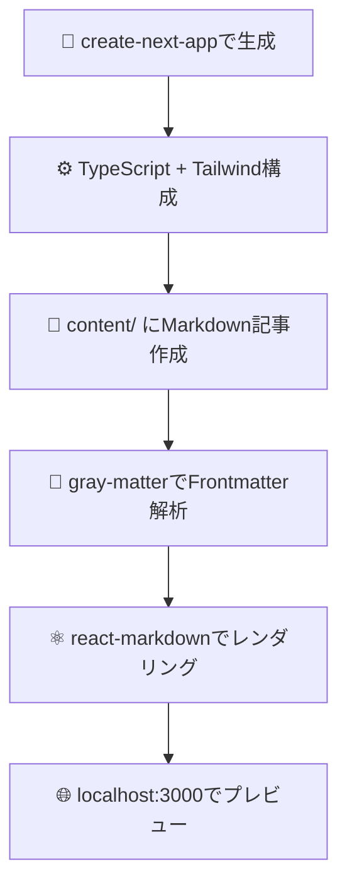
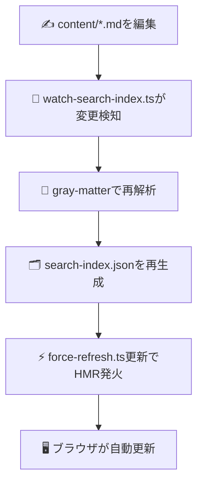
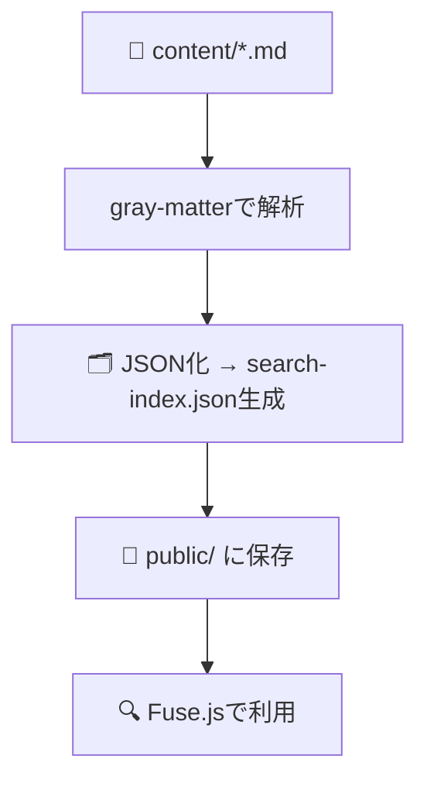
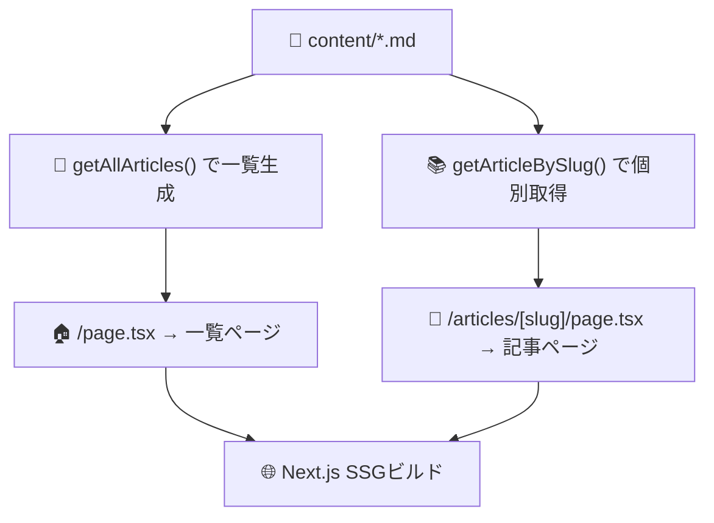
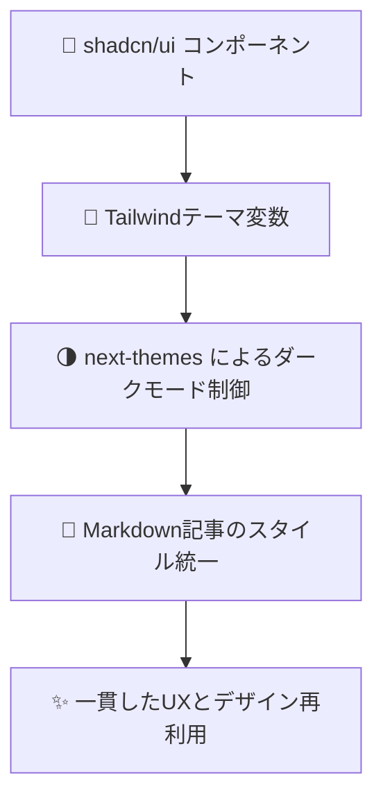
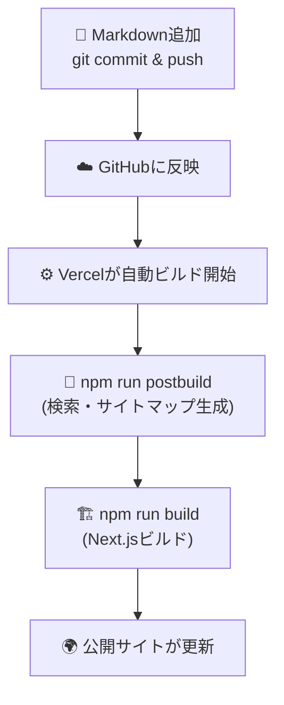
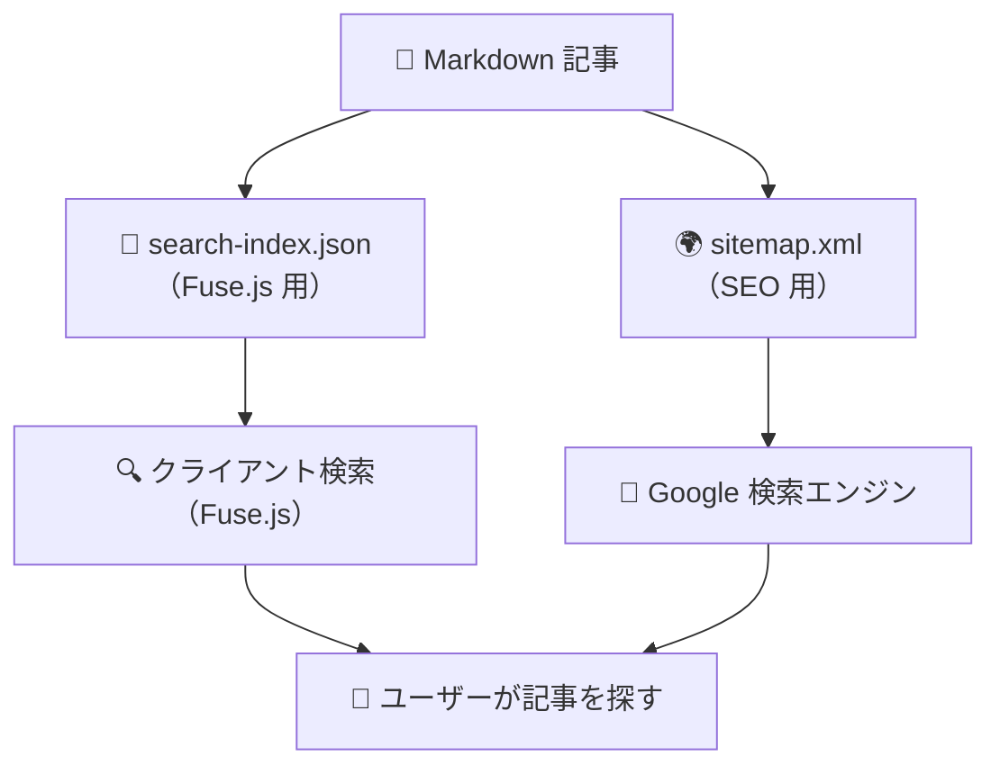
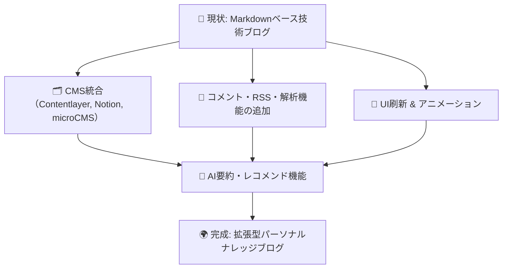

## 🧭 1. はじめに

個人の学習記録や技術メモをまとめるとき、
「**QiitaやZennに投稿するほどじゃないけど、きちんと形に残したい**」
そんな場面は多いと思います。

この記事では、**GitHub・Next.js・Vercel・Markdown** の4つを組み合わせて、
**自分専用の技術ブログサイト**をゼロから構築する方法を紹介します。

---

### 🔧 本記事のゴール

完成形は、こんな特徴を持つシンプルな技術ブログです：

- 記事はすべて **Markdownファイル** (`content/` ディレクトリ内)
- 自動で **記事一覧・検索・タグ機能** が生成される
- デプロイは **Vercel連携だけで自動反映**
- デザインは **Tailwind CSS** + **ダークモード対応**
- ソースコードはすべて **GitHubで管理**

実際のイメージとしては、ZennやTechBlogのような
「**自分の知識を積み重ねていくストック型ブログ**」を想定しています。

---

### 🧰 使用技術と構成

| 技術                         | 用途                   | 補足                                 |
| ---------------------------- | ---------------------- | ------------------------------------ |
| **Next.js 14 (App Router)**  | サイト本体の実装       | ルーティング・ビルド・SEO対応        |
| **Markdown + gray-matter**   | 記事データの管理       | タイトルやタグをFrontmatterで定義    |
| **Tailwind CSS + shadcn/ui** | UIデザイン             | コンポーネントとダークモード対応     |
| **Fuse.js**                  | 記事検索               | `search-index.json` に基づく全文検索 |
| **Vercel**                   | デプロイ・ホスティング | GitHub連携で自動更新                 |
| **GitHub**                   | ソースコード管理       | mainブランチにpushで即反映           |

---

### 💡 なぜMarkdownで書くのか？

Markdownを使う最大のメリットは、**「開発環境と同じリズムで書ける」** ことです。
VSCodeやNeovimなど自分のエディタで記事を書き、Git commitで履歴を残し、
pushするだけで自動的にサイトが更新されます。

CMSや管理画面を用意する必要もなく、
「**エンジニアが自分の思考をコードと同じように管理できる**」のが魅力です。

---

### 🚀 対象読者

- 自分の技術ブログを **無料で・簡単に・長く運用したい人**
- Next.js / React / Tailwind の基本がわかる人
- CMSを使わず、**Markdown中心の静的ブログ**を作りたい人

---

### 📦 完成イメージ

構築後は以下のような流れで更新できます：

```bash
# 1. 新しい記事を作成
$ touch content/articles/nextjs-intro.md

# 2. Markdownで記事を書く
# ---
# title: "Next.jsの基本"
# tags: ["Next.js", "React"]
# summary: "Next.jsの基礎をまとめました。"
# ---

# 3. commit & push
$ git add .
$ git commit -m "Add new article"
$ git push origin main
```

すると、Vercelが自動でデプロイして
あなたのブログに新しい記事がすぐ反映されます。

---

## 🏗️ 2. 全体構成の概要

この章では、**ブログ全体の構成**と**データの流れ**を整理します。
本サイト「**techblog**」は、以下の4つの技術でシンプルに構成されています：

- **GitHub**：ソースコードと記事を一元管理
- **Next.js**：静的ブログを生成・表示するWebアプリ
- **Markdown**：記事データを扱う軽量マークアップ言語
- **Vercel**：デプロイとホスティング（CI/CD一体型）

---

### 🔄 全体のアーキテクチャ



> `watch-search-index.ts` がローカル開発中の**ホットリロード**を実現。
> Markdownファイルを更新すると、即座に `search-index.json` が再生成され、
> Next.js のHMR（Hot Module Replacement）によってブラウザが自動更新されます。

---

### 🧱 コンポーネント構成の全体像

Next.jsを中心に、「**静的サイト生成（SSG）＋クライアント検索＋ホットリロード**」で構築しています。
この設計により、バックエンドを持たずに**軽量で即時反映されるブログ環境**を実現しています。

| 層                              | 役割                                     | 主なフォルダ / ファイル                                   |
| ------------------------------- | ---------------------------------------- | --------------------------------------------------------- |
| **Presentation (UI層)**         | ユーザー向けのUI（Tailwind / shadcn/ui） | `/app`, `/components`, `/features`                        |
| **Content (データ層)**          | Markdown記事とメタ情報を扱う             | `/content`, `/scripts/generate-search-index.ts`           |
| **Watcher (開発補助層)**        | Markdown変更を検知しインデックスを再生成 | `/scripts/watch-search-index.ts`, `/lib/force-refresh.ts` |
| **Infrastructure (デプロイ層)** | GitHub & Vercel によるCI/CD              | GitHubリポジトリ, Vercel連携設定                          |
| **Utility層**                   | 共通関数や型定義、検索機能               | `/lib`, `/features/searchResults`                         |

---

### 💡 設計方針のポイント

1. **データ管理はファイル単位（Gitで完結）**
   記事は `content/` ディレクトリ配下のMarkdownとして管理。
   バージョン管理やレビュー履歴がGit上で追跡でき、履歴がそのまま資産になる。

2. **Next.jsのSSGでSEOと表示速度を両立**
   ビルド時に静的HTMLを生成するため、表示が速く、検索エンジンにも強い。

3. **Fuse.jsによるクライアントサイド検索**
   記事メタ情報を `search-index.json` にまとめ、ブラウザ内で全文検索を実現。
   外部APIやDBを使わず、軽量かつメンテナンス性が高い。

4. **ホットリロード対応で即時反映**
   `watch-search-index.ts` がMarkdownの変更を監視し、
   自動でインデックスを再生成・再ビルド。
   記事を保存した瞬間にプレビューへ反映される。

5. **Vercelによる自動デプロイ**
   GitHubにpushするだけで、Vercelがビルドから公開まで自動化。
   ローカル環境と本番環境の差異が生まれにくい構成。

---

### 📊 実際の処理フロー



---

### 🧩 ディレクトリ構成（抜粋）

```bash
techblog/
├── app/                      # Next.js App Router構成
│   ├── page.tsx              # トップページ
│   └── articles/[slug]/      # 記事ページ
├── content/                  # Markdown記事を配置
│   └── sample.md
├── features/searchResults/   # 検索機能（Fuse.js）
├── lib/                      # 共通関数・設定
│   ├── utils.ts
│   ├── constants.ts
│   └── force-refresh.ts      # HMRトリガーファイル
├── scripts/                  # ビルド・監視スクリプト
│   ├── generate-search-index.ts
│   ├── watch-search-index.ts
│   └── generate-sitemap.ts
├── public/                   # 公開ファイル群（favicon, sitemap）
└── tailwind.config.ts
```

---

### 🔍 この構成で得られるメリット

- **完全なバックエンドレス構成**で動作
- 記事を保存した瞬間に自動更新される**快適な開発体験**
- GitHub連携により、**記事の変更がそのまま履歴管理**になる
- **Vercelの自動デプロイ**によって常に最新状態を公開
- **Markdownベースの柔軟な拡張性**（Zenn風・ポートフォリオ化などにも応用可能）

---

次章では、`gray-matter` と `react-markdown` を使って
MarkdownファイルをHTMLとしてレンダリングし、
「ファイルを追加するだけで記事ページが生成される」仕組みを実装していきます。

---

## ⚙️ 3. プロジェクトのセットアップ

ここからは、実際に **Next.js + TypeScript + Tailwind CSS** を使って
ブログを動かすための開発環境を構築していきます。

---

### 🧩 3.1 プロジェクトの作成

まずは、Next.jsのプロジェクトを作成します。
今回は TypeScript を前提にした構成です。

```bash
# Next.jsの新規プロジェクトを作成
npx create-next-app@latest techblog --typescript
```

セットアップ時の選択肢は次のように回答します：

| 質問                                                  | 推奨回答         |
| ----------------------------------------------------- | ---------------- |
| Would you like to use ESLint?                         | ✅ Yes           |
| Would you like to use Tailwind CSS?                   | ✅ Yes           |
| Would you like to use src/ directory?                 | 任意（好みでOK） |
| Use App Router (recommended)?                         | ✅ Yes           |
| Would you like to customize the default import alias? | ✅ Yes → `@/*`   |

---

### 🧱 3.2 ディレクトリ構成を整理

作成後の構成をベースに、後で使用するフォルダを追加します。

```bash
cd techblog
mkdir -p content scripts features lib
```

最終的に以下のような構成を目指します👇

```bash
techblog/
├── app/                     # Next.js App Router構成
│   ├── layout.tsx
│   └── page.tsx
├── content/                 # Markdown記事を格納
│   └── sample.md
├── features/                # 検索などの機能モジュール
├── lib/                     # 共通関数・設定
├── public/                  # 画像・検索indexなど
├── scripts/                 # ビルド時スクリプト
├── tailwind.config.ts
└── tsconfig.json
```

---

### 💅 3.3 Tailwind CSS 設定

Tailwindは `create-next-app` で自動設定されますが、
テーマ拡張を少し調整しておくと便利です。
`tailwind.config.ts` を次のように編集します：

```ts
import type { Config } from "tailwindcss";

const config: Config = {
  darkMode: ["class"],
  content: [
    "./app/**/*.{ts,tsx}",
    "./components/**/*.{ts,tsx}",
    "./features/**/*.{ts,tsx}",
    "./content/**/*.{md,mdx}",
  ],
  theme: {
    extend: {
      colors: {
        background: "hsl(var(--background))",
        foreground: "hsl(var(--foreground))",
      },
    },
  },
  plugins: [],
};

export default config;
```

この設定により、Markdown由来のコンテンツにもTailwindが適用されます。
（後で `react-markdown` で記事をHTML化するために必要です）

---

### 🧰 3.4 開発時に便利なライブラリを追加

```bash
npm install gray-matter react-markdown remark-gfm rehype-highlight rehype-raw fuse.js
npm install --save-dev eslint-plugin-simple-import-sort prettier-plugin-tailwindcss
```

| パッケージ                      | 役割                                           |
| ------------------------------- | ---------------------------------------------- |
| **gray-matter**                 | MarkdownのFrontmatter（title, tagsなど）を解析 |
| **react-markdown**              | MarkdownをReactコンポーネントに変換            |
| **remark-gfm**                  | GFM（表・チェックリストなど）対応              |
| **rehype-highlight**            | コードブロックのシンタックスハイライト         |
| **rehype-raw**                  | HTMLタグを安全に解釈                           |
| **fuse.js**                     | フロントエンド検索用ライブラリ                 |
| **prettier-plugin-tailwindcss** | Tailwindクラスの自動整列                       |

---

### 🧪 3.5 ESLintとPrettierの統合

コード品質と整形ルールを統一して、保守性を高めます。
`.eslintrc.json` の例は以下の通りです。

```json
{
  "extends": [
    "next/core-web-vitals",
    "eslint:recommended",
    "plugin:prettier/recommended"
  ],
  "plugins": ["simple-import-sort"],
  "rules": {
    "simple-import-sort/imports": "error",
    "simple-import-sort/exports": "error"
  }
}
```

---

### 🧱 3.6 Markdownテスト用のサンプルを追加

`content/hello-world.md` を作成：

````md
---
title: "Hello World"
summary: "初めてのMarkdown記事です"
tags: ["Next.js", "Markdown"]
---

# Hello World 👋

これはテックブログの最初の記事です。  
コードブロックもOK。

```ts
console.log("Hello from Markdown!");
```
````

---

### 🚀 3.7 開発サーバを起動

依存関係をインストールしたら、開発サーバを起動します。

```bash
npm install
npm run dev
```

ブラウザで [http://localhost:3000](http://localhost:3000) にアクセスし、
Next.jsの初期ページが表示されればOKです。

---

### 📈 3.8 セットアップの流れ（Mermaid）



---

### 🎯 ここまでで得られること

- 自分のブログを **完全にローカルで管理できる基盤** が整う
- **デザイン（Tailwind）・記事構造（Markdown）・コード品質（ESLint）** が統一
- 今後の章で実装する **検索機能・ホットリロード・自動デプロイ** に備えた構成が完成

---

次章では、`gray-matter` と `react-markdown` を使って
MarkdownファイルをHTMLとしてレンダリングし、
記事を追加するだけで自動的にページが生成される仕組みを実装していきます。

---

## 📝 4. Markdownコンテンツの構築

ここからは、実際に `content/` 配下の Markdown ファイルを読み込み、
**記事一覧や記事ページを自動生成** する仕組みを実装していきます。

さらに、開発中に記事を編集すると即時反映されるよう、
**ホットリロード対応** の仕組みも組み込みます。

---

### 🧩 4.1 Markdownの読み込み

まずは、Markdownを読み取って記事データに変換する関数を作ります。
`gray-matter` を使って Frontmatter（タイトル・タグなど）を解析します。

`lib/articles.ts`：

```ts
import fs from "fs";
import path from "path";
import matter from "gray-matter";

const CONTENT_DIR = path.join(process.cwd(), "content");

/**
 * 記事一覧を取得
 */
export function getAllArticles() {
  const files = fs.readdirSync(CONTENT_DIR);

  return files
    .filter((file) => file.endsWith(".md"))
    .map((file) => {
      const filePath = path.join(CONTENT_DIR, file);
      const content = fs.readFileSync(filePath, "utf-8");
      const { data, content: body } = matter(content);

      return {
        slug: file.replace(/\.md$/, ""),
        title: data.title || "Untitled",
        summary: data.summary || "",
        tags: data.tags || [],
        date: data.date || "",
        content: body,
      };
    });
}

/**
 * 特定記事を取得
 */
export function getArticleBySlug(slug: string) {
  const filePath = path.join(CONTENT_DIR, `${slug}.md`);
  const content = fs.readFileSync(filePath, "utf-8");
  const { data, content: body } = matter(content);

  return {
    slug,
    title: data.title || "Untitled",
    summary: data.summary || "",
    tags: data.tags || [],
    date: data.date || "",
    content: body,
  };
}
```

---

### ⚛️ 4.2 MarkdownをHTMLに変換して表示

次に、`react-markdown` を使ってHTMLとしてレンダリングします。
コードブロックのハイライトも `rehype-highlight` で対応します。

`app/articles/[slug]/page.tsx`：

```tsx
import { getArticleBySlug, getAllArticles } from "@/lib/articles";
import ReactMarkdown from "react-markdown";
import rehypeHighlight from "rehype-highlight";
import remarkGfm from "remark-gfm";

type Props = {
  params: { slug: string };
};

export async function generateStaticParams() {
  const articles = getAllArticles();
  return articles.map((article) => ({ slug: article.slug }));
}

export default function ArticlePage({ params }: Props) {
  const article = getArticleBySlug(params.slug);

  return (
    <article className="prose dark:prose-invert mx-auto p-8">
      <h1>{article.title}</h1>
      <p className="text-sm text-gray-500">{article.summary}</p>

      <ReactMarkdown
        remarkPlugins={[remarkGfm]}
        rehypePlugins={[rehypeHighlight]}
      >
        {article.content}
      </ReactMarkdown>
    </article>
  );
}
```

これで `content/hello-world.md` が
自動的に `/articles/hello-world` として表示されるようになります。

---

### 🗂️ 4.3 記事一覧ページの生成

トップページなどで一覧を表示したい場合は、
同じく `getAllArticles()` を使って一覧を作ります。

`app/page.tsx`：

```tsx
import Link from "next/link";
import { getAllArticles } from "@/lib/articles";

export default function HomePage() {
  const articles = getAllArticles();

  return (
    <main className="max-w-3xl mx-auto p-8">
      <h1 className="text-3xl font-bold mb-6">📚 Articles</h1>

      <ul className="space-y-6">
        {articles.map((article) => (
          <li key={article.slug}>
            <Link
              href={`/articles/${article.slug}`}
              className="block group hover:opacity-80 transition"
            >
              <h2 className="text-xl font-semibold">{article.title}</h2>
              <p className="text-gray-500">{article.summary}</p>
              <div className="mt-1 flex gap-2">
                {article.tags.map((tag: string) => (
                  <span
                    key={tag}
                    className="text-sm bg-gray-100 dark:bg-gray-800 rounded px-2 py-0.5"
                  >
                    #{tag}
                  </span>
                ))}
              </div>
            </Link>
          </li>
        ))}
      </ul>
    </main>
  );
}
```

---

### 🔄 4.4 ホットリロードの仕組み

開発中にMarkdownを変更したとき、
即座にNext.js側のプレビューへ反映させるために
**`watch-search-index.ts`** というスクリプトを使います。

`scripts/watch-search-index.ts`：

```ts
import chokidar from "chokidar";
import fs from "fs";
import path from "path";
import matter from "gray-matter";

const contentDir = path.join(process.cwd(), "content");
const indexPath = path.join(process.cwd(), "public", "search-index.json");

function generateSearchIndex() {
  const files = fs.readdirSync(contentDir).filter((f) => f.endsWith(".md"));
  const index = files.map((file) => {
    const filePath = path.join(contentDir, file);
    const raw = fs.readFileSync(filePath, "utf-8");
    const { data, content } = matter(raw);
    return {
      slug: file.replace(/\.md$/, ""),
      title: data.title || "",
      summary: data.summary || "",
      tags: data.tags || [],
      content,
    };
  });

  fs.writeFileSync(indexPath, JSON.stringify(index, null, 2));
  triggerRerender();
}

function triggerRerender() {
  const refreshFile = path.join(process.cwd(), "lib", "force-refresh.ts");
  fs.writeFileSync(
    refreshFile,
    `// refreshed at ${new Date().toISOString()}\n`,
  );
  console.log("🔁 search-index regenerated & HMR triggered");
}

chokidar
  .watch(contentDir, { ignoreInitial: true })
  .on("add", generateSearchIndex)
  .on("change", generateSearchIndex)
  .on("unlink", generateSearchIndex);

console.log("👀 Watching Markdown files...");
generateSearchIndex();
```

このスクリプトを別ターミナルで起動しておくと、
Markdownの追加・変更がリアルタイムで反映されます👇

```bash
npx tsx scripts/watch-search-index.ts
```

---

### ⚙️ 4.5 自動起動の設定（package.json）

`package.json` にスクリプトを追加して、
開発時にNext.jsとウォッチャーを同時に起動できるようにします。

```json
{
  "scripts": {
    "dev": "concurrently \"next dev\" \"npx tsx scripts/watch-search-index.ts\""
  },
  "devDependencies": {
    "concurrently": "^8.2.2"
  }
}
```

```bash
npm install --save-dev concurrently
```

これで、以下のコマンドを実行すればOKです。

```bash
npm run dev
```

→ Next.jsサーバーとウォッチャーが並行で動作し、
Markdownを保存した瞬間にブラウザが自動更新されます。

---

### 📊 4.6 フロー全体のイメージ



---

### 🎯 まとめ

- `gray-matter` で Markdown のメタ情報を解析
- `react-markdown` で記事をHTMLとして表示
- `watch-search-index.ts` により、記事を保存した瞬間にUIへ反映
- バックエンドなしで「編集 → 即反映」の開発体験を実現

---

## 🔍 5. 記事データのインデックス化

ここでは、Markdownで書かれた記事データを
**検索しやすい形式（インデックス）に変換する処理**を実装します。

Next.jsのビルド時に `content/` 以下のすべてのMarkdownを解析し、
`public/search-index.json` にまとめて出力します。
このファイルは、後で実装する全文検索機能（Fuse.js）で使用します。

---

### 🧠 5.1 インデックス生成の目的

- サイト上の記事を**即座に検索できるようにする**
- クライアントサイドで検索を完結させ、**バックエンド不要**にする
- Vercel上でも**静的ファイルとして配信可能**にする

つまり、インデックスは「軽量な検索用データベース」として機能します。

---

### 🗂️ 5.2 スクリプトの作成

次のスクリプトを `scripts/generate-search-index.ts` に追加します。
これは **ビルド時** や **watcher起動時** に自動実行される処理です。

```ts
import fs from "fs";
import path from "path";
import matter from "gray-matter";

const CONTENT_DIR = path.join(process.cwd(), "content");
const OUTPUT_FILE = path.join(process.cwd(), "public", "search-index.json");

function generateSearchIndex() {
  const files = fs.readdirSync(CONTENT_DIR).filter((f) => f.endsWith(".md"));
  const articles = files.map((file) => {
    const filePath = path.join(CONTENT_DIR, file);
    const raw = fs.readFileSync(filePath, "utf-8");
    const { data, content } = matter(raw);

    return {
      slug: file.replace(/\.md$/, ""),
      title: data.title || "Untitled",
      summary: data.summary || "",
      tags: data.tags || [],
      date: data.date || "",
      content,
    };
  });

  fs.writeFileSync(OUTPUT_FILE, JSON.stringify(articles, null, 2));
  console.log(`✅ search-index.json generated (${articles.length} articles)`);
}

generateSearchIndex();
```

---

### ⚙️ 5.3 npmスクリプトに追加

このスクリプトを簡単に実行できるよう、`package.json` に登録しておきます。

```json
{
  "scripts": {
    "build:index": "npx tsx scripts/generate-search-index.ts"
  }
}
```

実行例：

```bash
npm run build:index
```

`public/search-index.json` が生成されれば成功です。

---

### 📦 5.4 生成されるデータの構造

生成された `search-index.json` は次のような構造になります：

```json
[
  {
    "slug": "hello-world",
    "title": "Hello World",
    "summary": "初めてのMarkdown記事です",
    "tags": ["Next.js", "Markdown"],
    "date": "2025-10-01",
    "content": "# Hello World 👋 ..."
  }
]
```

このファイルを使えば、クライアント側で `title` や `tags`、`content` を対象に
Fuse.jsで柔軟な検索を実行できるようになります。

---

### 🧩 5.5 Next.jsとの連携（自動生成）

`search-index.json` は、**開発時・ビルド時のどちらでも自動生成**できるようにします。

`next.config.mjs` に以下を追加します：

```js
// next.config.mjs
import { execSync } from "child_process";

const config = {
  webpack: (config) => {
    // ビルド前にインデックスを生成
    execSync("npm run build:index", { stdio: "inherit" });
    return config;
  },
};

export default config;
```

これで `npm run build` を実行すると、
自動的に `search-index.json` が作られ、
常に最新の状態でビルドが行われるようになります。

---

### 📈 5.6 処理フローのイメージ



---

### 💡 5.7 インデックス方式の設計意図

| 項目               | 方針                       | 理由                                     |
| ------------------ | -------------------------- | ---------------------------------------- |
| **保存場所**       | `public/search-index.json` | クライアントサイドで直接取得できる       |
| **更新タイミング** | ビルド時・watcher起動時    | ローカル開発と本番デプロイの両方をカバー |
| **形式**           | フラットなJSON配列         | Fuse.jsが最適に処理できる構造            |
| **依存関係**       | gray-matter                | MarkdownのFrontmatter解析が簡単で高速    |

---

### 🎯 インデックス化まとめ

- `content/` 内のMarkdownを解析して **search-index.json** を自動生成
- **バックエンド不要**で、検索用データベースをフロントに埋め込める
- Next.jsビルド時にも自動生成されるため、**常に最新の状態を維持**

---

次章では、この `search-index.json` をクライアントサイドで読み込み、
**Fuse.jsを用いた全文検索機能** を実装していきます。

---

## 📰 6. 記事ページと一覧ページの実装

これまでに構築した

- Markdownの読み込み（`lib/articles.ts`）
- 記事データのインデックス化（`search-index.json`）

をもとに、**記事一覧ページ**と**記事詳細ページ**を実装していきます。
これで、ブログとしての基本的な閲覧機能が完成します。

---

### 🗂️ 6.1 記事一覧ページ

トップページでは、`getAllArticles()` で取得した記事一覧を
タイトル・概要・タグ付きで表示します。

`app/page.tsx`：

```tsx
import Link from "next/link";
import { getAllArticles } from "@/lib/articles";

export default function HomePage() {
  const articles = getAllArticles();

  return (
    <main className="max-w-3xl mx-auto p-8">
      <h1 className="text-3xl font-bold mb-8">📚 Articles</h1>

      <ul className="space-y-6">
        {articles.map((article) => (
          <li key={article.slug}>
            <Link
              href={`/articles/${article.slug}`}
              className="block group hover:opacity-80 transition"
            >
              <h2 className="text-xl font-semibold group-hover:underline">
                {article.title}
              </h2>
              {article.summary && (
                <p className="text-gray-500 dark:text-gray-400 mt-1">
                  {article.summary}
                </p>
              )}
              {article.tags?.length > 0 && (
                <div className="mt-2 flex flex-wrap gap-2">
                  {article.tags.map((tag: string) => (
                    <span
                      key={tag}
                      className="text-sm bg-gray-100 dark:bg-gray-800 text-gray-700 dark:text-gray-300 rounded px-2 py-0.5"
                    >
                      #{tag}
                    </span>
                  ))}
                </div>
              )}
            </Link>
          </li>
        ))}
      </ul>
    </main>
  );
}
```

このページでは、`/content` 配下のMarkdownファイルが
自動的に記事一覧として表示されます。

---

### 📄 6.2 記事ページ

個別記事ページでは、`slug`（ファイル名）をもとに
Markdownを読み込み、`react-markdown` でHTMLとして描画します。

`app/articles/[slug]/page.tsx`：

```tsx
import { getAllArticles, getArticleBySlug } from "@/lib/articles";
import ReactMarkdown from "react-markdown";
import rehypeHighlight from "rehype-highlight";
import remarkGfm from "remark-gfm";

type Props = {
  params: { slug: string };
};

export async function generateStaticParams() {
  const articles = getAllArticles();
  return articles.map((article) => ({ slug: article.slug }));
}

export default function ArticlePage({ params }: Props) {
  const article = getArticleBySlug(params.slug);

  return (
    <article className="prose dark:prose-invert mx-auto p-8">
      <h1>{article.title}</h1>
      {article.date && (
        <p className="text-sm text-gray-500 mb-4">{article.date}</p>
      )}

      <ReactMarkdown
        remarkPlugins={[remarkGfm]}
        rehypePlugins={[rehypeHighlight]}
      >
        {article.content}
      </ReactMarkdown>

      {article.tags?.length > 0 && (
        <div className="mt-6 flex flex-wrap gap-2">
          {article.tags.map((tag: string) => (
            <span
              key={tag}
              className="text-sm bg-gray-100 dark:bg-gray-800 text-gray-700 dark:text-gray-300 rounded px-2 py-0.5"
            >
              #{tag}
            </span>
          ))}
        </div>
      )}
    </article>
  );
}
```

ポイント：

- **`generateStaticParams()`** により、記事をSSG（静的生成）
- **`rehype-highlight`** でコードブロックのハイライト対応
- **`remark-gfm`** で表やリスト、リンクなどの拡張Markdown構文を有効化

---

### 🧱 6.3 レイアウト構成の統一

共通レイアウトを `app/layout.tsx` に設定しておくと、
どのページでもヘッダーやテーマが統一されます。

`app/layout.tsx`：

```tsx
import "./globals.css";
import { Inter } from "next/font/google";

const inter = Inter({ subsets: ["latin"] });

export const metadata = {
  title: "techblog",
  description: "個人の技術ブログサイト",
};

export default function RootLayout({
  children,
}: {
  children: React.ReactNode;
}) {
  return (
    <html lang="ja" className="dark">
      <body className={`${inter.className} bg-background text-foreground`}>
        <header className="p-4 border-b border-gray-200 dark:border-gray-700">
          <h1 className="text-2xl font-semibold">techblog</h1>
        </header>
        <main>{children}</main>
      </body>
    </html>
  );
}
```

このように、**シンプルで軽量なUI** にしておくと、
後で `shadcn/ui` などを導入しても拡張しやすくなります。

---

### 🌐 6.4 ページのルーティング構造

Next.jsのApp Routerでは、
フォルダ構成そのものがルーティングとして機能します。

```bash
app/
├── page.tsx               # 一覧ページ（/）
└── articles/
    └── [slug]/
        └── page.tsx       # 記事ページ（/articles/[slug]）
```

つまり、`content/hello-world.md` は
自動的に `/articles/hello-world` として表示されます。

---

### 📈 6.5 フロー図（Mermaid）



---

### 🎯 ページ作成まとめ

- 記事一覧と詳細ページのルーティングをApp Routerで自動生成
- Markdownを `gray-matter` + `react-markdown` でHTML化
- コードハイライト・タグ表示・日付などのメタ情報も表示可能
- SSG（静的生成）により、高速かつSEOに強いブログ構成が完成

---

## 🎨 7. UIデザインとテーマ

この章では、**Tailwind CSS** と **shadcn/ui** を用いた
UIデザインの構築とテーマ（ライト／ダークモード対応）を実装します。

---

### 🌈 7.1 デザイン方針

本ブログは「**読みやすく・整っていて・壊れにくいUI**」を重視しています。
特に次の3点を設計の柱としました。

1. **余白と文字サイズの統一** — Tailwindのユーティリティで全体のバランスを揃える
2. **コンポーネント分離** — 記事カード・タグ・ボタンなどを再利用可能に
3. **ダークモード対応** — `class` ベースの切り替えで統一感を維持

---

### 💅 7.2 Tailwind CSS のテーマ拡張

`tailwind.config.ts` にテーマ変数を定義しておくと、
デザイン変更やテーマ切り替えがスムーズになります。

```ts
import type { Config } from "tailwindcss";

const config: Config = {
  darkMode: ["class"],
  theme: {
    extend: {
      colors: {
        background: "hsl(var(--background))",
        foreground: "hsl(var(--foreground))",
        primary: "hsl(var(--primary))",
        secondary: "hsl(var(--secondary))",
        muted: "hsl(var(--muted))",
      },
      fontFamily: {
        sans: ["Inter", "system-ui", "sans-serif"],
      },
    },
  },
  plugins: [],
};

export default config;
```

---

### 🧩 7.3 shadcn/ui の導入

TailwindベースのUIコンポーネント集である [**shadcn/ui**](https://ui.shadcn.com/) を導入します。
これにより、ボタンやカードなどを高品質なデザインで統一できます。

```bash
npx shadcn-ui@latest init
npx shadcn-ui@latest add button card badge input
```

追加したコンポーネントは `/components/ui/` に配置されます。
例として `Button` コンポーネントを活用したシンプルな例👇

```tsx
import { Button } from "@/components/ui/button";

export default function Example() {
  return (
    <div className="p-6">
      <Button variant="default">記事を読む</Button>
    </div>
  );
}
```

---

### 🌙 7.4 ダークモード対応

`class` ベースのテーマ切り替えを採用します。
`next-themes` を導入して、ライト／ダークの状態を管理しましょう。

```bash
npm install next-themes
```

`app/providers.tsx` に設定を追加：

```tsx
"use client";
import { ThemeProvider } from "next-themes";

export function Providers({ children }: { children: React.ReactNode }) {
  return (
    <ThemeProvider attribute="class" defaultTheme="system" enableSystem>
      {children}
    </ThemeProvider>
  );
}
```

そして `app/layout.tsx` でラップします👇

```tsx
import "./globals.css";
import { Providers } from "./providers";

export default function RootLayout({
  children,
}: {
  children: React.ReactNode;
}) {
  return (
    <html lang="ja" suppressHydrationWarning>
      <body className="bg-background text-foreground transition-colors">
        <Providers>{children}</Providers>
      </body>
    </html>
  );
}
```

これで、OSテーマに合わせて自動で切り替わるようになります。
任意で、ナビゲーションバーに「テーマトグルボタン」を追加すると便利です。

---

### 🧠 7.5 記事レイアウトのデザイン例

Markdown記事を`react-markdown`でレンダリングするとき、
要素ごとにTailwindクラスを指定してスタイルを統一できます。

```tsx
import ReactMarkdown from "react-markdown";

export default function ArticleContent({ content }: { content: string }) {
  return (
    <article className="prose dark:prose-invert max-w-none">
      <ReactMarkdown>{content}</ReactMarkdown>
    </article>
  );
}
```

`@tailwindcss/typography` プラグインを利用すれば、
見出しやリンクのデフォルトスタイルも整います👇

```bash
npm install @tailwindcss/typography
```

`tailwind.config.ts` に追加：

```ts
plugins: [require("@tailwindcss/typography")],
```

---

### 🧭 7.6 UI設計の全体像



---

### 🪶 7.7 まとめ

- **Tailwind + shadcn/ui** でデザイン基盤を確立
- **next-themes** によりダークモードを自然に実装
- **@tailwindcss/typography** でMarkdownを美しく整形

ここまでで、ブログ全体の見た目とテーマが完成しました。
次章では、**Fuse.jsを使った検索機能**を追加していきます。

---

## 🚀 8. サイトの公開

ここまでで、Markdown記事をもとに動作する技術ブログが完成しました。
最後に、**Vercelを使ってインターネット上に公開**しましょう。

VercelはNext.js開発元が提供するホスティングサービスで、
GitHubと連携するだけで **ビルド → デプロイ → 公開** がすべて自動化されます。

---

### 🌐 8.1 GitHub へのプッシュ

まず、作成したブログをGitHubにアップロードします。

```bash
# Gitリポジトリを初期化
git init
git add .
git commit -m "Initial commit: techblog"

# GitHubのリポジトリを作成（例）
gh repo create techblog --public --source=. --remote=origin

# プッシュ
git push -u origin main
```

これでGitHub上にコードがアップされました。
Vercelはこのリポジトリを監視して、自動的に更新を反映してくれます。

---

### ☁️ 8.2 Vercel にデプロイ

[Vercel Dashboard](https://vercel.com/) にアクセスし、
GitHubアカウントでログインします。

1. 「**New Project**」をクリック
2. 「**Import Git Repository**」で `techblog` を選択
3. Framework は自動で **Next.js** が検出されます
4. Build Command を次のように変更👇

   ```bash
   npm run postbuild && npm run build
   ```

5. Output Directory は自動設定（`/.next`）
6. Deploy ボタンをクリック

数分後、`https://techblog.vercel.app` のようなURLで公開されます 🎉

---

### 🔄 8.3 自動デプロイ（CI/CD）

Vercelは、**GitHubのmainブランチにpushされるたび**に以下を自動実行します。

1. `npm install`
2. `npm run postbuild`（記事インデックス・サイトマップ生成）
3. `npm run build`（Next.js静的ビルド）
4. デプロイ＆公開

つまり、Markdownを追加してcommit → pushするだけで、
サイトが自動的に更新されます。

```bash
# 記事追加例
echo "---\ntitle: '新しい記事'\n---\n本文..." > content/new-post.md
git add .
git commit -m "Add new post"
git push origin main
```

数十秒後にはVercelが自動で再ビルドし、新しい記事が公開されます。

---

### ⚡ 8.4 ホットリロードとローカル開発

ローカルでは次のコマンドで開発できます。

```bash
npm run dev
```

このスクリプトでは、`next dev` と同時に
`scripts/watch-search-index.ts` が実行され、
**Markdownの変更を監視しながら `search-index.json` を自動更新**します。

これにより、記事の追加・編集が即座に反映され、
開発中のホットリロード体験が格段に快適になります。

> 🔍 `watch-search-index.ts` は `fs.watch` で `content/` ディレクトリを監視し、
> 記事変更時に `generate-search-index.ts` を再実行しています。
> → ローカルでは即時反映、本番では `postbuild` で再生成。

---

### 🧱 8.5 package.json のスクリプト設定

最終的な `package.json` のスクリプト定義は以下の通りです：

```json
{
  "scripts": {
    "dev": "npx concurrently -k -n \"next,watch\" -c \"cyan,magenta\" \"next dev\" \"npx tsx scripts/watch-search-index.ts\"",
    "build": "next build",
    "start": "next start",
    "lint": "next lint",
    "generate:search": "tsx scripts/generate-search-index.ts",
    "generate:sitemap": "tsx scripts/generate-sitemap.ts",
    "postbuild": "npm run generate:search && npm run generate:sitemap"
  }
}
```

| スクリプト           | 説明                                           |
| -------------------- | ---------------------------------------------- |
| **dev**              | Next.jsサーバー＋記事ウォッチャーを同時起動    |
| **postbuild**        | ビルド前に検索インデックスとサイトマップを生成 |
| **generate:search**  | `search-index.json` を生成（Fuse.js用）        |
| **generate:sitemap** | 検索エンジン向けの `sitemap.xml` を生成        |
| **build**            | Next.js本体をビルド（SSG）                     |

---

### 📊 8.6 デプロイの流れまとめ



---

### ✅ 8.7 公開後の運用ポイント

- Markdownを追加 → push で即反映
- ローカルでは `npm run dev` でホットリロード付き開発
- `postbuild` によって、記事一覧とsitemapが常に最新に保たれる

---

### 🪶 まとめ

- GitHubとVercel連携で**完全自動デプロイ**
- `postbuild` により**ビルド時に記事データを自動生成**
- ローカルでは `watch-search-index.ts` による**リアルタイム更新**

これで、「書く → push → 公開」の理想的なワークフローが完成しました 🚀

---

## 🔍 9. 検索とSEO対策

この章では、**ユーザーが目的の記事を探しやすくし、検索エンジンにも最適化されたブログ**に仕上げるための仕組みを整えます。

ここまでで `search-index.json` や `generate-sitemap.ts` はすでに登場していますが、
それらをSEO・検索体験の観点からまとめて最適化していきます。

---

### 🔡 9.1 検索機能の改善 (Fuse.js)

検索機能は、`Fuse.js` を使った**クライアントサイド全文検索**で実装されています。
ブラウザ上で `search-index.json` を読み込み、
ユーザーが検索ボックスに入力したキーワードに応じて即座に絞り込みを行います。

```ts
import Fuse from "fuse.js";

const fuse = new Fuse(articles, {
  keys: ["title", "summary", "tags", "content"],
  threshold: 0.3,
});

export const searchArticles = (query: string) => {
  return query ? fuse.search(query).map((res) => res.item) : articles;
};
```

#### 🧠 Fuse.jsの特徴

- サーバー不要で軽量（CDN対応も可能）
- タイトル・タグ・本文など複数フィールドを横断検索
- `threshold` で曖昧検索の度合いを調整できる
  → 例：0.3 なら「Next」でも「Next.js」にマッチ

#### 🚀 運用フロー

1. 開発中は `watch-search-index.ts` によりホットリロード対応
2. 本番では `postbuild` により `search-index.json` を再生成
3. フロントエンドで `Fuse.js` が検索結果を即時反映

---

### 🌐 9.2 サイトマップ生成 (`generate-sitemap.ts`)

検索エンジン（Google, Bingなど）が記事を正しくクロールできるように、
`scripts/generate-sitemap.ts` で自動生成するサイトマップを用意します。

```ts
import fs from "fs";
import path from "path";

const BASE_URL = "https://techblog.vercel.app";
const contentDir = path.join(process.cwd(), "content");

const generateSitemap = () => {
  const files = fs.readdirSync(contentDir);
  const urls = files
    .filter((file) => file.endsWith(".md"))
    .map((file) => {
      const slug = file.replace(/\.md$/, "");
      return `<url><loc>${BASE_URL}/articles/${slug}</loc></url>`;
    });

  const xml = `<?xml version="1.0" encoding="UTF-8"?>
  <urlset xmlns="http://www.sitemaps.org/schemas/sitemap/0.9">
  ${urls.join("\n")}
  </urlset>`;

  fs.writeFileSync("public/sitemap.xml", xml);
  console.log("✅ sitemap.xml generated");
};

generateSitemap();
```

これにより、**デプロイ時に常に最新記事のURLを含むsitemap.xml**が生成されます。
Google Search Console に登録すれば、SEO効果を最大化できます。

---

### 🪞 9.3 メタデータとOGP設定

Next.js App Routerでは、`app/layout.tsx` や各ページで
`metadata` オブジェクトを使ってメタ情報を定義できます。

```ts
export const metadata = {
  title: "TechBlog – 技術ブログ",
  description: "GitHub・Next.js・Vercel・Markdownで作る個人技術ブログ",
  openGraph: {
    title: "TechBlog",
    description: "エンジニアのためのMarkdownベース技術ブログ",
    url: "https://techblog.vercel.app",
    siteName: "TechBlog",
    images: ["/ogp.png"],
    locale: "ja_JP",
    type: "website",
  },
};
```

これにより：

- Google 検索結果で適切なタイトルと説明文が表示される
- SNS（X, Facebook, Discordなど）での共有時に**OGP画像と説明が自動表示**

> 💡 画像は `/public/ogp.png` に配置。
> 記事ごとに個別のOGP画像を生成したい場合は `next/og` API や `@vercel/og` を利用可能です。

---

### 🤖 9.4 robots.txt と Search Console

SEO対策として、クロール設定を明示する `robots.txt` を `public/` に配置します。

```txt
User-agent: *
Allow: /
Sitemap: https://techblog.vercel.app/sitemap.xml
```

あわせて、Google Search Console に
`https://techblog.vercel.app/sitemap.xml` を登録しておくと良いです。
これで記事のクロールが自動化され、検索反映も早まります。

---

### 📈 9.5 Analytics 連携（任意）

アクセス解析を行いたい場合は、
`Vercel Analytics` または `Google Analytics` を導入します。

例：`next/script` を使った GA 設定

```tsx
import Script from "next/script";

export default function Analytics() {
  return (
    <Script
      async
      src={`https://www.googletagmanager.com/gtag/js?id=${process.env.NEXT_PUBLIC_GA_ID}`}
    />
  );
}
```

`.env` に以下を追加：

```env
NEXT_PUBLIC_GA_ID=G-XXXXXXX
```

---

### 🧭 9.6 検索・SEO構成のまとめ



---

### ✅ まとめ

- `Fuse.js` による**即時検索**でUXを最適化
- `generate-sitemap.ts` により**クロール精度を自動管理**
- メタ情報・OGP・robots.txtで**SEOを強化**
- `postbuild`で全データを自動生成する構成で**運用コストゼロ**

これで、**「人にも検索エンジンにも優しいブログ」**が完成です。

---

## 🧩 10. 今後の発展

このブログは、**「Markdownで記事を書く → push → 自動公開」**というシンプルな構成を重視しています。
ここからさらに発展させることで、より高度な知識共有プラットフォームへ進化させることができます。

---

### 🗂️ 10.1 CMSの導入（Contentlayer / Notion / microCMS）

Markdown運用は軽量で便利ですが、記事数が増えると管理が煩雑になります。
将来的には**CMS（Content Management System）**を導入して、
記事データを外部から管理することも可能です。

| 手法             | 特徴                                                |
| ---------------- | --------------------------------------------------- |
| **Contentlayer** | Markdownを型安全に扱える。Next.jsと統合性が高い。   |
| **Notion API**   | NotionをそのままCMS化。執筆体験が快適。             |
| **microCMS**     | 日本語対応のヘッドレスCMS。非エンジニアも編集可能。 |

これらを使えば、**非開発者でも記事を追加・編集**できるようになります。

---

### 💬 10.2 コメント機能やリアクションの追加

読者との交流を生むために、以下のような仕組みを追加できます。

- **Giscus**（GitHub Discussionsを利用したコメント）
- **Utterances**（GitHub Issues連携）
- **自作API＋Supabase** で軽量コメント機能を構築

これにより、ブログが一方通行ではなく**コミュニティ的な場**へ発展します。

---

### 📰 10.3 RSSフィード・メール購読

新着記事を自動配信したい場合は、RSSやニュースレター機能を追加します。

- `scripts/generate-rss.ts` で `rss.xml` を生成
- Vercel Cron で定期更新
- `buttondown.email` や `ConvertKit` を使ってメール購読を提供

これにより、**読者が定期的に最新記事を受け取れる仕組み**を作れます。

---

### 📊 10.4 アクセス解析・人気記事ランキング

人気記事を分析したい場合は、以下の方法が有効です。

| 手法                                   | 説明                           |
| -------------------------------------- | ------------------------------ |
| **Vercel Analytics**                   | 設定不要でPVを簡易解析         |
| **Google Analytics 4**                 | 詳細な流入経路・行動分析が可能 |
| **自作カウンター（Supabase / Redis）** | ページ別PVをリアルタイム集計   |

ランキングページや「よく読まれている記事」セクションを自動生成するのもおすすめです。

---

### 🎨 10.5 デザインリニューアル・UX強化

UI/UXの面では、次のような改良も可能です。

- **`shadcn/ui`** によるモダンで統一感のあるコンポーネント設計
- **Framer Motion** を使ったトランジションやアニメーション追加
- **テーマ拡張（フォント・カラー・レイアウト）**
- **記事内目次（Table of Contents）** の自動生成

> デザイン刷新を通して、**「読まれる」ブログから「使われる」メディアへ**進化できます。

---

### 🧱 10.6 ビルド高速化とパフォーマンス最適化

記事数が増えるとSSGビルドに時間がかかるため、
以下の最適化を検討します。

- **`next/cache`** や **ISR (Incremental Static Regeneration)** の活用
- **分割ビルド（部分再生成）** の導入
- **画像最適化（next/image + CDN）**
- **preload / prefetch戦略** の見直し

これにより、大規模化してもスケーラブルに運用できます。

---

### 🧠 10.7 AI要約・推薦機能

今後は、**生成AIを活用して記事をより賢く届ける**ことも可能です。

- LLMを使った **「この記事の要約」** 機能
- 類似記事を自動提案する **レコメンドエンジン**
- ChatGPT APIやLangChainを用いた **知識ベース化**

> Markdown記事をベクトルDBに埋め込み、
> 「過去の記事から関連テーマを探すAIナビゲーション」も実現できます。

---

### 🚀 10.8 今後の展望まとめ



---

### ✅ 10.9 まとめ

- 現在の構成（Markdown × Next.js × Vercel）は**最小構成として理想的**
- 将来的にCMS・AI・解析を組み合わせることで**継続的な進化が可能**
- コードも記事もGitで管理できるため、**拡張性・透明性・再現性が高い**

このプロジェクトは、**「学びのストックを形に残すためのベース」**として、
そのままプロダクト開発・ナレッジプラットフォームへ発展させることもできます。

---

## 🧭 11. まとめ

ここまでで、**GitHub・Next.js・Vercel・Markdown** を組み合わせた
開発者向けの技術ブログの構築手順を一通り解説してきました。

この仕組みの最大の特徴は、
**「コードと記事を同じGitで管理し、pushだけで公開できる」** という点にあります。

---

### ✅ 今回作ったブログの特徴

| 項目            | 内容                                                           |
| --------------- | -------------------------------------------------------------- |
| 🧩 **技術構成** | Next.js（App Router） + Tailwind CSS + TypeScript              |
| 📝 **記事管理** | Markdown + gray-matter でメタ情報を扱う                        |
| 🔍 **検索機能** | Fuse.js によるクライアントサイド全文検索                       |
| 🧠 **自動生成** | `postbuild` で `search-index.json` と `sitemap.xml` を自動生成 |
| 🚀 **デプロイ** | GitHub → Vercel で push 即デプロイ（CI/CD構成）                |
| 🎨 **UI設計**   | Tailwind + shadcn/ui + next-themes でダークモード対応          |

このように、**バックエンドレスで完結する静的ブログ**ながら、
更新性・拡張性・パフォーマンスをすべて両立できています。

---

### 💡 この構成の魅力

- Markdownなので、**VSCodeやNeovimでそのまま執筆可能**
- 記事の更新＝Git commitで履歴が残る
- `Fuse.js` 検索・`sitemap.xml`・`metadata` でSEO対策も万全
- チームでも個人でも、**再現性の高いワークフロー**を維持できる

> CMSを使わず、**エンジニアらしいブログ運営を極めたい人**に最適な構成です。

---

### 🚀 今後の展開

本記事で紹介した構成は、
個人ブログだけでなく**チームのナレッジ共有サイト**にも応用できます。

- `Notion API` や `Contentlayer` でCMS化
- `Supabase` や `Giscus` でコメント機能を追加
- `@vercel/og` で記事ごとのOGP画像を自動生成
- AI要約・レコメンド機能を組み込む

→ こうした発展もすべて、**この基盤の上に積み上げるだけ**で実現可能です。

---

### ✍️ 最後に

エンジニアにとって「書くこと」は、
知識の整理であり、学びの再利用です。

**GitHubで管理し、Next.jsで表示し、Vercelで届ける。**
それだけで、あなたの学びは「資産」に変わります。

ぜひ、この記事をきっかけに
**自分だけの技術ブログ**を作り、知識を積み上げていきましょう。

---

📦 ソースコード構成例やビルドスクリプトの詳細は、
本文の各章（特に 5章〜8章）を参考にしてください。

あなたの手で構築したブログが、
「学びを発信する最高のアウトプット環境」になるはずです。 🚀
