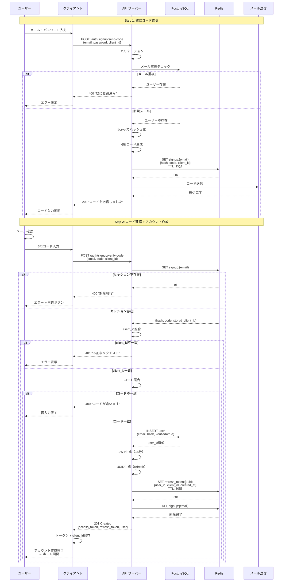
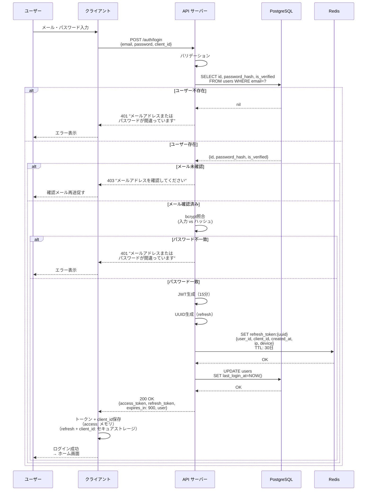
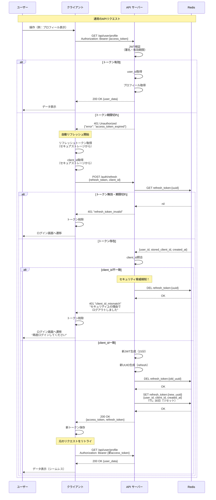
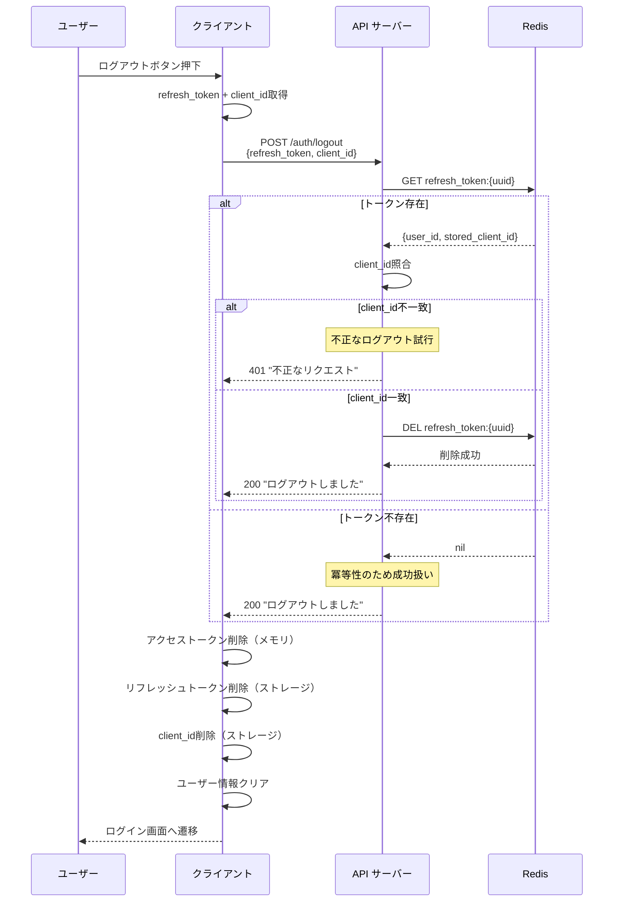
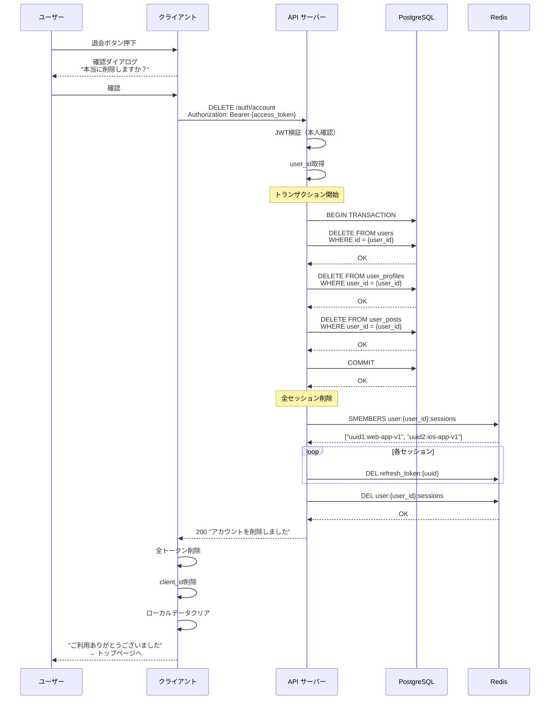

## 3. シーケンス図で理解する認証フロー

### 3.1 なぜシーケンス図が重要か

#### 時系列で考えることの重要性

認証システムの実装で最もつまずきやすいのが、**「誰が」「いつ」「何を」するのか**が曖昧になることです。

```
よくある失敗例：
❌ 「トークンを保存する」← どこに？いつ？
❌ 「トークンを検証する」← 誰が？どのタイミングで？
❌ 「ログアウトする」← クライアント側？サーバー側？両方？
```

これらの疑問を解消するのが**シーケンス図**です。

**シーケンス図の利点：**

- ✅ 時間軸に沿って処理を可視化
- ✅ クライアント・サーバー・DB・Redisの役割分担が明確
- ✅ エラーハンドリングのタイミングが分かる
- ✅ 実装前に設計の穴を発見できる

#### 状態遷移を可視化する

認証システムは**状態遷移の塊**です：

```
未認証 → 認証中 → 認証済み → セッション期限切れ → 再認証 → ログアウト
```

この状態遷移を頭の中だけで管理しようとすると、必ず実装時に混乱します。

**実装前にシーケンス図を描くべき理由：**

1. **設計の抜け漏れを防ぐ**

   - 「リフレッシュトークンの削除を忘れてた」
   - 「エラー時のロールバック処理がない」

2. **チーム内で認識を統一**

   - フロントエンド・バックエンドで仕様が食い違わない
   - レビュー時に議論しやすい

3. **実装の優先順位が明確になる**
   - MVP（最小限の機能）はどこまでか
   - どの部分を後回しにできるか

---

### 3.2 5つの独立したフローで考える

認証システムを設計するとき、私が最も重視しているのは：

> 💡 **重要な気づき**: これらを独立したフローとして設計すると実装が格段にシンプルになる

**5つの独立したフロー：**

1. **サインアップ（新規登録）** - 新しくアカウントを作る
2. **ログイン（既存ユーザー）** - 既存のアカウントで入る
3. **ログイン中（API利用）** - トークンを使って操作する
4. **ログアウト（セッション終了）** - セッションを終わらせる
5. **退会（アカウント削除）** - アカウントを消す

**なぜ独立させるのか？**

```
❌ 悪い設計：全部を一つの巨大な関数で処理
  → if文の嵐、状態管理が複雑、テストが困難

✅ 良い設計：各フローを独立したエンドポイント・関数に
  → 単一責任、テストしやすい、変更に強い
```

**API設計例：**

```
POST /auth/signup/send-code     → サインアップ開始
POST /auth/signup/verify-code   → サインアップ完了
POST /auth/login                → ログイン
POST /auth/refresh              → トークン更新（ログイン中）
POST /auth/logout               → ログアウト
DELETE /auth/account            → 退会
```

各エンドポイントが独立しているため、実装・テスト・デバッグが容易になります。

---

### 3.3 各フローの詳細

#### 3.3.1 サインアップフロー

**採用方式：Instagram方式（メール確認後に即ログイン）**



**設計のポイント：**

1. **client_idの役割**

   ```
   目的：リフレッシュトークンの不正利用を防ぐ

   シナリオ：
   攻撃者がリフレッシュトークンを盗んだ
   → でもclient_idが分からない
   → トークン更新できない
   ```

2. **client_idの種類**

   ```javascript
   // クライアント側で定義
   const CLIENT_IDS = {
     WEB: 'web-app-v1',
     IOS: 'ios-app-v1',
     ANDROID: 'android-app-v1'
   }

   // ログイン時に送信
   {
     "email": "user@example.com",
     "password": "SecurePass123!",
     "client_id": "web-app-v1"
   }
   ```

3. **Redisの保存構造（仮登録）**

   ```
   Key: signup:{email}
   Value: {
     "password_hash": "$2a$10$...",
     "code": "123456",
     "client_id": "web-app-v1",
     "created_at": "2025-10-19T10:00:00Z"
   }
   TTL: 900秒 (15分)
   ```

4. **Redisの保存構造（本登録後）**

   ```
   Key: refresh_token:{uuid}
   Value: {
     "user_id": 123,
     "client_id": "web-app-v1",
     "created_at": "2025-10-19T10:00:00Z",
     "ip_address": "192.168.1.1",      // オプション
     "device_info": "iPhone 15 Pro"     // オプション
   }
   TTL: 2592000秒 (30日)
   ```

---

#### 3.3.2 ログインフロー

**既存ユーザーが認証情報を使って入る流れ**



**設計のポイント：**

1. **client_idの保存場所（クライアント側）**

   ```typescript
   // Web（localStorage）
   localStorage.setItem('client_id', 'web-app-v1');
   localStorage.setItem('refresh_token', 'uuid...');

   // iOS（Keychain）
   KeychainHelper.save(key: "client_id", value: "ios-app-v1")
   KeychainHelper.save(key: "refresh_token", value: "uuid...")

   // Android（EncryptedSharedPreferences）
   securePrefs.edit()
     .putString("client_id", "android-app-v1")
     .putString("refresh_token", "uuid...")
     .apply()
   ```

2. **エラーメッセージの工夫**

   ```
   ❌ 悪い例：
   "メールアドレスが存在しません"
   "パスワードが間違っています"

   ✅ 良い例：
   "メールアドレスまたはパスワードが間違っています"
   ```

   - メールアドレスの存在を推測させない（セキュリティ）
   - アカウント列挙攻撃を防ぐ

3. **レート制限の実装**

   ```mermaid
   sequenceDiagram
       participant C as クライアント
       participant API as API サーバー
       participant R as Redis

       C->>API: POST /auth/login
       API->>R: INCR rate_limit:{email}<br/>EXPIRE 300秒
       R-->>API: 試行回数

       alt 5回以上
           API-->>C: 429 "しばらくお待ちください"
       else 5回未満
           API->>API: 通常のログイン処理
       end
   ```

---

#### 3.3.3 ログイン中フロー（自動リフレッシュ + client_id検証）

**最も重要なフロー：トークン期限切れの自動処理とセキュリティ検証**



**client_id検証の重要性：**

1. **攻撃シナリオの防止**

   ```
   攻撃者の行動：
   1. 何らかの方法でリフレッシュトークンを盗む
      （例：ネットワーク盗聴、マルウェア、フィッシング）

   2. 自分のデバイスでトークンリフレッシュを試みる
      → client_id が "attacker-device-v1" になる

   3. サーバー側で検証
      stored_client_id: "web-app-v1"
      request_client_id: "attacker-device-v1"
      → 不一致！

   4. トークンを即座に無効化
      → 攻撃失敗
      → 正規ユーザーは次回ログイン時に気づく
   ```

2. **セキュリティレイヤーの多層化**

   ```
   第1層：リフレッシュトークン（UUID）
     → ランダムで推測不可能

   第2層：client_id
     → トークンとセットで必要
     → デバイス/プラットフォーム固有

   第3層：Redis TTL
     → 30日で自動失効

   第4層：トークンローテーション
     → 使用後は即座に無効化
   ```

3. **実装のポイント**

   ```go
   // サーバー側の検証ロジック
   func RefreshTokens(refreshToken, clientID string) (*TokenPair, error) {
       // Redisからセッション取得
       session, err := redis.Get("refresh_token:" + refreshToken)
       if err != nil {
           return nil, ErrInvalidToken
       }

       // client_id照合
       if session.ClientID != clientID {
           // 不正アクセス検知！
           log.Warn("client_id mismatch detected",
               "user_id", session.UserID,
               "stored", session.ClientID,
               "requested", clientID)

           // トークンを即座に無効化
           redis.Del("refresh_token:" + refreshToken)

           // 監視アラート送信（オプション）
           alertSecurityTeam(session.UserID, "token_theft_suspected")

           return nil, ErrClientIDMismatch
       }

       // 検証成功 → 新トークン発行
       return generateNewTokenPair(session.UserID, clientID)
   }
   ```

4. **クライアント側の実装例**

   ```typescript
   // リフレッシュ処理
   async function refreshTokens(): Promise<boolean> {
     const refreshToken = getRefreshToken();
     const clientId = getClientId();

     if (!refreshToken || !clientId) {
       return false;
     }

     try {
       const response = await fetch("/auth/refresh", {
         method: "POST",
         headers: { "Content-Type": "application/json" },
         body: JSON.stringify({
           refresh_token: refreshToken,
           client_id: clientId,
         }),
       });

       if (response.status === 401) {
         const error = await response.json();

         if (error.error === "client_id_mismatch") {
           // セキュリティ警告を表示
           alert(
             "セキュリティ上の理由でログアウトしました。再度ログインしてください。",
           );
         }

         // トークン削除
         clearTokens();
         return false;
       }

       if (response.ok) {
         const data = await response.json();
         saveTokens(data.access_token, data.refresh_token);
         return true;
       }

       return false;
     } catch (error) {
       console.error("Token refresh failed:", error);
       return false;
     }
   }
   ```

---

#### 3.3.4 ログアウトフロー

**セッションを明示的に終了する**



**設計のポイント：**

1. **ログアウト時のclient_id検証**

   ```
   理由：
   攻撃者がリフレッシュトークンだけ盗んでも
   client_idがないとログアウトもできない

   → 正規ユーザーのセッションを勝手に切れない
   ```

2. **全デバイスログアウト（オプション）**

   ```mermaid
   sequenceDiagram
       participant C as クライアント
       participant API as API サーバー
       participant R as Redis

       C->>API: POST /auth/logout-all<br/>Authorization: Bearer {access_token}

       API->>API: JWT検証（本人確認）
       API->>R: KEYS refresh_token:*
       R-->>API: 全トークンリスト

       loop 各トークン
           API->>R: GET refresh_token:{uuid}
           R-->>API: {user_id, client_id}

           alt 自分のトークン
               API->>R: DEL refresh_token:{uuid}
           end
       end

       API-->>C: 200 "全デバイスでログアウトしました"
   ```

   **より効率的な実装（推奨）：**

   ```
   Redis構造を工夫：

   user:{user_id}:sessions = Set of {uuid}:{client_id}

   ログイン時：
   SADD user:123:sessions "uuid-1:web-app-v1"

   全ログアウト時：
   SMEMBERS user:123:sessions
   → 各UUIDに対してDEL refresh_token:{uuid}
   → DEL user:123:sessions
   ```

---

#### 3.3.5 退会フロー

**アカウントを完全に削除する**



**設計のポイント：**

1. **セッション管理の改善版**

   ```
   従来：全トークンをスキャン
   KEYS refresh_token:* → 重い！

   改善：ユーザーごとにセッションリスト管理
   user:{user_id}:sessions → 軽い！

   構造：
   user:123:sessions = Set {
     "uuid-1:web-app-v1",
     "uuid-2:ios-app-v1",
     "uuid-3:android-app-v1"
   }
   ```

2. **client_idも含めたセッション管理**

   ```go
   // ログイン時
   sessionKey := fmt.Sprintf("%s:%s", uuid, clientID)
   redis.SAdd(fmt.Sprintf("user:%d:sessions", userID), sessionKey)

   // 退会時
   sessions := redis.SMembers(fmt.Sprintf("user:%d:sessions", userID))
   for _, session := range sessions {
       uuid := strings.Split(session, ":")[0]
       redis.Del(fmt.Sprintf("refresh_token:%s", uuid))
   }
   redis.Del(fmt.Sprintf("user:%d:sessions", userID))
   ```

---

## まとめ（第2回）

### 今回学んだこと

1. **シーケンス図の重要性**

   - 時系列で考えることで実装の迷いがなくなる
   - クライアント・サーバー・DB・Redisの役割が明確に

2. **5つの独立したフロー**

   - サインアップ：メール確認 → 即ログイン（+ client_id保存）
   - ログイン：認証情報でトークン発行（+ client_id紐付け）
   - ログイン中：自動リフレッシュ + **client_id検証**
   - ログアウト：リフレッシュトークン無効化（client_id照合）
   - 退会：データ削除と全セッション抹消

3. **client_idによるセキュリティ強化**

   - リフレッシュトークン単体では使えない
   - デバイス/プラットフォーム固有の識別子が必要
   - 不正利用を即座に検知・無効化
   - セキュリティレイヤーの多層化

4. **実装の実践的なポイント**
   - エラーメッセージでセキュリティ情報を漏らさない
   - レート制限でブルートフォース攻撃を防ぐ
   - リフレッシュトークンローテーション
   - **client_id照合で盗難対策**
   - 冪等性を確保してリトライ安全に

### 次回予告

次回は [**「トークンの保存場所とセキュリティ」**](https://techblog-v2.vercel.app/auth/auth-tutorial-3) です。

- Web/モバイルでのトークン保存戦略
- **client_idの管理方法**
- **HttpOnly Cookieの理想と現実**（重要！）
- XSS/CSRF対策の実装
- セキュアストレージの選択肢

特に「HttpOnly Cookieはセキュアだけどモバイルで使えない」という現実的な問題と、client_idを含めた実践的なトークン管理について詳しく解説します。
