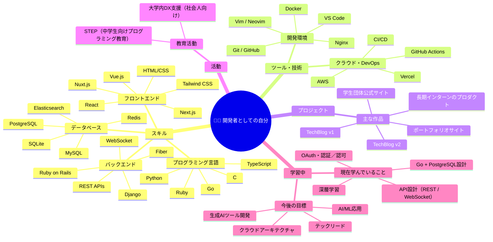
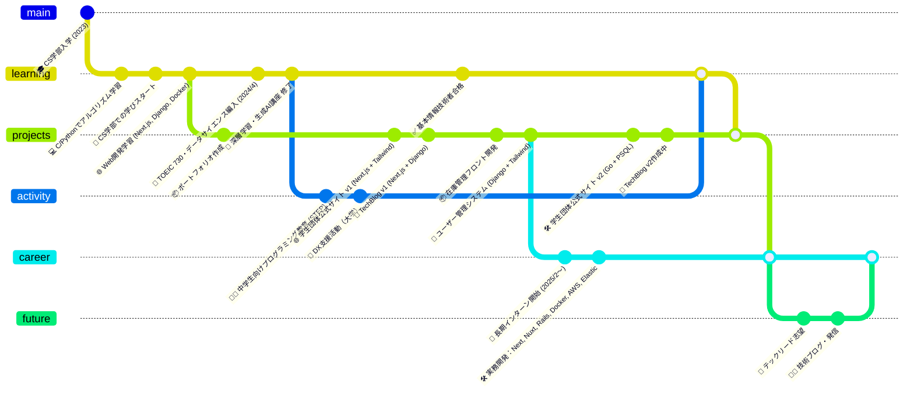

# 👋 自己紹介

こんにちは！Marteです。
大学でコンピュータサイエンスを専攻しています。

特にWeb開発や機械学習（AI）分野、
中でも深層学習や生成モデルに強い関心があります。

このサイトでは、学んでいることや考えたことを整理・発信していきます。

---

# 🧠 開発者スキルマップ（Mindmap）

---

# 🕰️ 開発者としての歩み（GitGraph）

---

# 🔗 リンク

- [GitHub](https://github.com/keu-5)
- [Qiita](https://qiita.com/keu5)

---
