```mermaid
gitGraph
    commit id: "🎓 CS学部入学 (2023)"
    branch learning
    checkout learning
    commit id: "💻 C/Pythonでアルゴリズム学習"
    commit id: "🧠 CS学部での学びスタート"
    commit id: "🌐 Web開発学習 (Next.js, Django, Docker)"
    branch projects
    checkout projects
    commit id: "📦 ポートフォリオ作成"
    checkout learning
    commit id: "🧪 TOEIC 730・データサイエンス編入 (2024/4)"
    commit id: "🧬 深層学習・生成AI講座 修了"
    branch activity
    checkout activity
    commit id: "🧑‍🏫 中学生向けプログラミング教育 (STEP)"
    commit id: "🏢 DX支援活動（大学）"
    checkout projects
    commit id: "🌐 学生団体公式サイト v1 (Next.js + Tailwind)"
    commit id: "📘 TechBlog v1 (Next.js + Django)"
    checkout learning
    commit id: "✅ 基本情報技術者合格"
    checkout projects
    commit id: "📦 在庫管理フロント開発"
    commit id: "👥 ユーザー管理システム (Django + Tailwind)"
    branch career
    checkout career
    commit id: "💼 長期インターン開始 (2025/2〜)"
    commit id: "🛠️ 実務開発：Next, Nuxt, Rails, Docker, AWS, Elastic"
    checkout projects
    commit id: "🛠️ 学生団体公式サイト v2 (Go + PSQL)"
    commit id: "📝 TechBlog v2作成中"
    checkout learning
    merge activity
    checkout projects
    merge learning
    checkout career
    merge projects
    branch future
    checkout future
    commit id: "🎯 テックリード志望"
    commit id: "🧑‍💻 技術ブログ・発信"
    checkout career
    merge future
```

# 👋 Introduction

Hay! I'm Marte, a univ student.

I study computer science, especially I'm into web development and machine learning (AI) like deep learning, generative model and so on.

So, I gonna think out loud what I am studying about!

# 🧠 Developer Skill Map (Mindmap Style)

A visual breakdown of my current skills, tools, projects, and learning focus as a full-stack developer.

```mermaid
mindmap
  root((🧑‍💻 Me as Developer))
    Skills
      Programming Languages
        ::icon(fa fa-code)
        TypeScript
        Python
        Go
        Ruby
        C
      Frontend
        ::icon(fa fa-laptop)
        Next.js
        Nuxt.js
        React
        Vue.js
        Tailwind CSS
        HTML/CSS
      Backend
        ::icon(fa fa-server)
        Django
        Ruby on Rails
        REST APIs
        WebSocket
        Fiber
      Database
        ::icon(fa fa-database)
        PostgreSQL
        MySQL
        SQLite
        Redis
        Elasticsearch
    Tools & Tech
      ::icon(fa fa-tools)
      Development
        Git / GitHub
        Docker
        VS Code
        Vim / Neovim
        Nginx
      Cloud & DevOps
        AWS
        Vercel
        GitHub Actions
        CI/CD
    Projects
      ::icon(fa fa-rocket)
      Major Works
        Portfolio Site
        TechBlog v1
        TechBlog v2
        長期インターンのプロダクト
        学生団体公式サイト
    Activities
      ::icon(fa fa-users)
      教育活動
        STEP (中学生向けプログラミング)
        大学内DX支援（社会人向け）
    Learning
      ::icon(fa fa-graduation-cap)
      Currently Studying
        深層学習
        Go + PostgreSQL設計
        OAuth & 認証・認可
        API設計（REST / WebSocket）
      Future Goals
        テックリード
        AI/ML応用
        生成AIツール開発
        クラウドアーキテクチャ
```

# 🕰️ My Developer Journey (GitGraph Style)

A chronological map of my developer journey, from entering CS to my current goals and practical experience.

# 🔗 Links

- [Github](https://github.com/keu-5)
- [Qiita](https://qiita.com/keu5)
